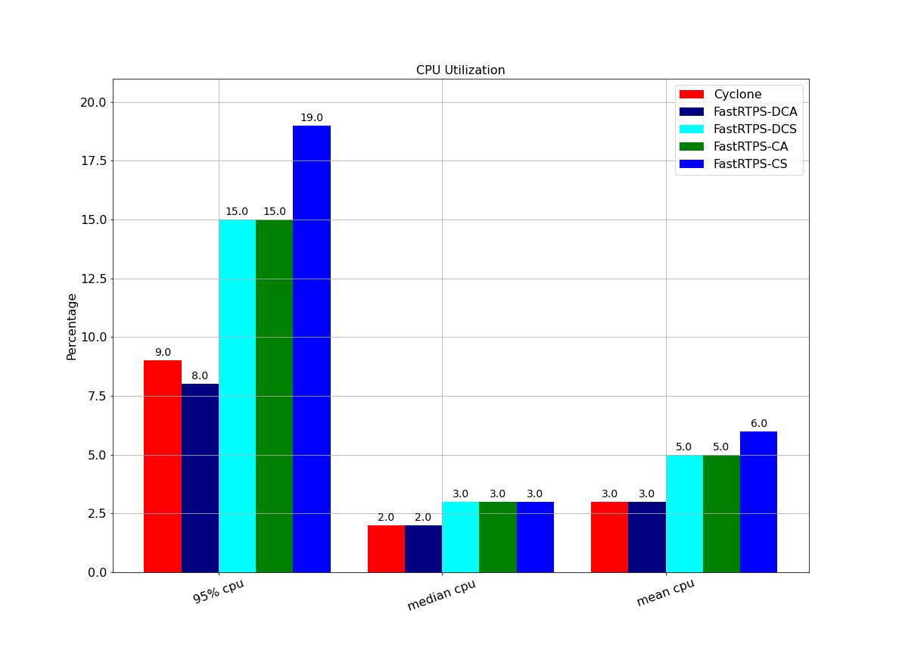
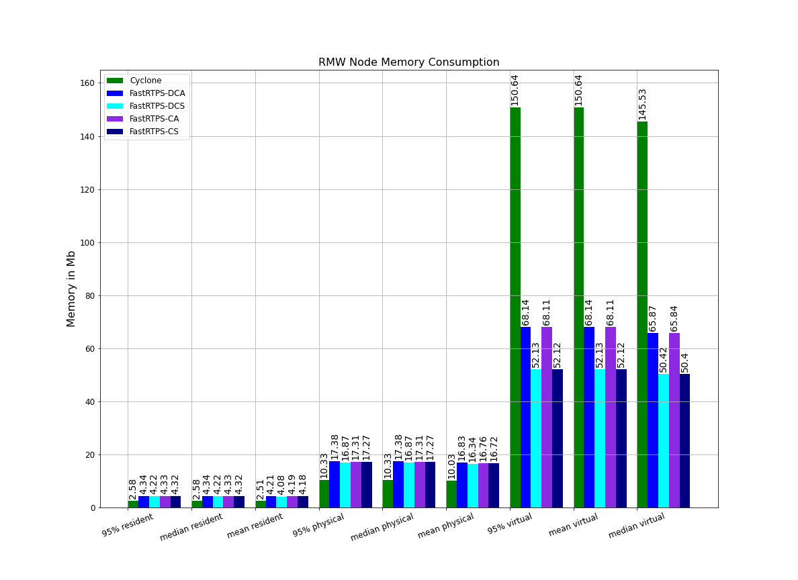
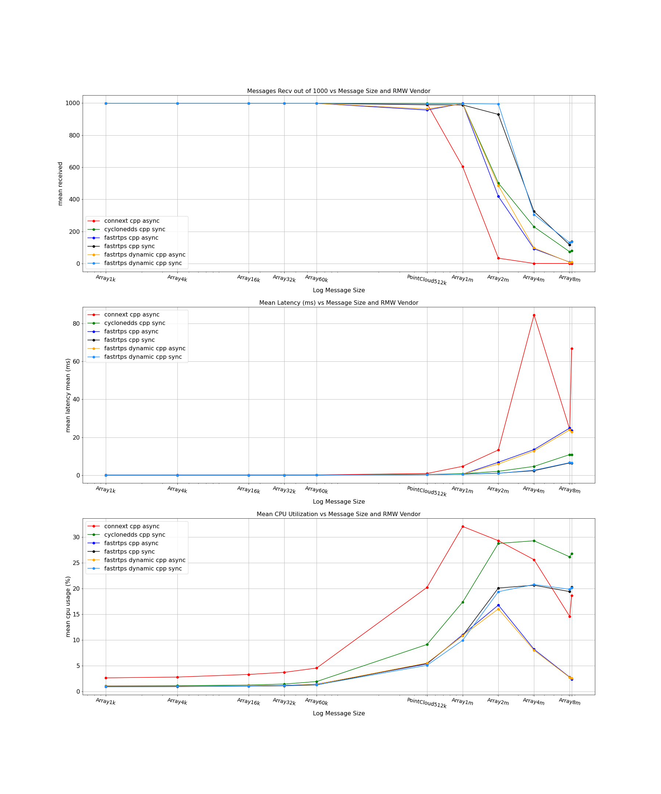

# Appendices and Supporting Materials

##  Appendix A: Full Build Farm Plots

For completeness we have provided all data available on the build farm; this includes data from Cyclone DDS, Connext DDS, and four variants of FastRTPS available on the buildfarm. The four available variants of Cyclone DDS include both dynamic and static memory variants along with two asynchronous and synchronous variants. Not all tests included all variants but we have included what data was available. These plots compare the four variants of FastRTPS were used during testing, dynamic C++ asynchronous (abbreviated DCA), C++ static (abbreviated CS), dynamic C++ synchronous (abbreviated DCS), and asynchronous C++ (abbreviate CA). One variant of Cyclone RMW was tested, which is the C++ static version.  The Connext RMW is also included for reference.

##  Appendix B: Full Mininet Experiments Report

### Comparing RMW Implementations Across Bandwidths and Packet Losses

Comparison is between the rmw implementations rmw_fastrtps_cpp async, rmw_fastrtps_cpp sync, and rmw_cyclonedds_cpp sync, and is
varied across bandwidth limits (1000, 300, and 54) and message type/rate
combinations (PointCloud512k@30 and Array1k@30).

Data was collected using the `run_experiments.py` script, and uses [mininet](http://mininet.org/)
to simulate adverse network conditions, potentially varying the bandwidth limit, packet loss,
and/or packet delay for each process.

Each experimental run consists of two processes, one containing a publisher and the other
containing a subscription.
Experiments are run for 15 seconds, and various statistics are collected, but for this
comparison only "number of messages sent/received per second" are considered.

#### Comparisons with Bandwidth Limited to 54Mbps

##### Comparison Publishing Array1k@30

The specific details for this experiment are as follows:

- 1 Publisher
- 1 Subscription
- Separate Processes
- Single Machine
- Number of Runs Averaged: 10
- RMW Implementation: rmw_fastrtps_cpp async/rmw_fastrtps_cpp sync/rmw_cyclonedds_cpp sync
- Message Type: Array1k
- Message Rate: 30
- Reliability QoS: reliable
- Durability QoS: volatile
- History Kind QoS: keep_last
- History Depth QoS: 10
- Bandwidth Limit (Mbps): 54
- Packet Loss Percentage: 0/10/20/30/40
- Packet Delay (ms): 0

###### rmw_cyclonedds_cpp sync

<table>
  <tr>
    <td>Packet Loss: 0%</td>
    <td>Packet Loss: 10%</td>
    <td>Packet Loss: 20%</td>
    <td>Packet Loss: 30%</td>
    <td>Packet Loss: 40%</td>
  </tr>
  <tr>
    <td valign="top"></td>
    <td valign="top"></td>
    <td valign="top"></td>
    <td valign="top"></td>
    <td valign="top"></td>
  </tr>
  <tr>
    <td valign="top"></td>
    <td valign="top"></td>
    <td valign="top"></td>
    <td valign="top"></td>
    <td valign="top"></td>
  </tr>
  <tr>
    <td valign="top"></td>
    <td valign="top"></td>
    <td valign="top"></td>
    <td valign="top"></td>
    <td valign="top"></td>
  </tr>
</table>

###### rmw_fastrtps_cpp async

<table>
  <tr>
    <td>Packet Loss: 0%</td>
    <td>Packet Loss: 10%</td>
    <td>Packet Loss: 20%</td>
    <td>Packet Loss: 30%</td>
    <td>Packet Loss: 40%</td>
  </tr>
  <tr>
    <td valign="top"></td>
    <td valign="top"></td>
    <td valign="top"></td>
    <td valign="top"></td>
    <td valign="top"></td>
  </tr>
  <tr>
    <td valign="top"></td>
    <td valign="top"></td>
    <td valign="top"></td>
    <td valign="top"></td>
    <td valign="top"></td>
  </tr>
  <tr>
    <td valign="top"></td>
    <td valign="top"></td>
    <td valign="top"></td>
    <td valign="top"></td>
    <td valign="top"></td>
  </tr>
</table>

###### rmw_fastrtps_cpp sync

<table>
  <tr>
    <td>Packet Loss: 0%</td>
    <td>Packet Loss: 10%</td>
    <td>Packet Loss: 20%</td>
    <td>Packet Loss: 30%</td>
    <td>Packet Loss: 40%</td>
  </tr>
  <tr>
    <td valign="top"></td>
    <td valign="top"></td>
    <td valign="top"></td>
    <td valign="top"></td>
    <td valign="top"></td>
  </tr>
  <tr>
    <td valign="top"></td>
    <td valign="top"></td>
    <td valign="top"></td>
    <td valign="top"></td>
    <td valign="top"></td>
  </tr>
  <tr>
    <td valign="top"></td>
    <td valign="top"></td>
    <td valign="top"></td>
    <td valign="top"></td>
    <td valign="top"></td>
  </tr>
</table>

##### Comparison Publishing PointCloud512k@30

The specific details for this experiment are as follows:

- 1 Publisher
- 1 Subscription
- Separate Processes
- Single Machine
- Number of Runs Averaged: 10
- RMW Implementation: rmw_fastrtps_cpp async/rmw_fastrtps_cpp sync/rmw_cyclonedds_cpp sync
- Message Type: PointCloud512k
- Message Rate: 30
- Reliability QoS: reliable
- Durability QoS: volatile
- History Kind QoS: keep_last
- History Depth QoS: 10
- Bandwidth Limit (Mbps): 54
- Packet Loss Percentage: 0/10/20/30/40
- Packet Delay (ms): 0

###### rmw_cyclonedds_cpp sync

<table>
  <tr>
    <td>Packet Loss: 0%</td>
    <td>Packet Loss: 10%</td>
    <td>Packet Loss: 20%</td>
    <td>Packet Loss: 30%</td>
    <td>Packet Loss: 40%</td>
  </tr>
  <tr>
    <td valign="top"></td>
    <td valign="top"></td>
    <td valign="top"></td>
    <td valign="top"></td>
    <td valign="top"></td>
  </tr>
  <tr>
    <td valign="top"></td>
    <td valign="top"></td>
    <td valign="top"></td>
    <td valign="top"></td>
    <td valign="top"></td>
  </tr>
  <tr>
    <td valign="top"></td>
    <td valign="top"></td>
    <td valign="top"></td>
    <td valign="top"></td>
    <td valign="top"></td>
  </tr>
</table>

###### rmw_fastrtps_cpp async

<table>
  <tr>
    <td>Packet Loss: 0%</td>
    <td>Packet Loss: 10%</td>
    <td>Packet Loss: 20%</td>
    <td>Packet Loss: 30%</td>
    <td>Packet Loss: 40%</td>
  </tr>
  <tr>
    <td valign="top"></td>
    <td valign="top"></td>
    <td valign="top"></td>
    <td valign="top"></td>
    <td valign="top"></td>
  </tr>
  <tr>
    <td valign="top"></td>
    <td valign="top"></td>
    <td valign="top"></td>
    <td valign="top"></td>
    <td valign="top"></td>
  </tr>
  <tr>
    <td valign="top"></td>
    <td valign="top"></td>
    <td valign="top"></td>
    <td valign="top"></td>
    <td valign="top"></td>
  </tr>
</table>

###### rmw_fastrtps_cpp sync

<table>
  <tr>
    <td>Packet Loss: 0%</td>
    <td>Packet Loss: 10%</td>
    <td>Packet Loss: 20%</td>
    <td>Packet Loss: 30%</td>
    <td>Packet Loss: 40%</td>
  </tr>
  <tr>
    <td valign="top"></td>
    <td valign="top"></td>
    <td valign="top"></td>
    <td valign="top"></td>
    <td valign="top"></td>
  </tr>
  <tr>
    <td valign="top"></td>
    <td valign="top"></td>
    <td valign="top"></td>
    <td valign="top"></td>
    <td valign="top"></td>
  </tr>
  <tr>
    <td valign="top"></td>
    <td valign="top"></td>
    <td valign="top"></td>
    <td valign="top"></td>
    <td valign="top"></td>
  </tr>
</table>

#### Comparisons with Bandwidth Limited to 300Mbps

##### Comparison Publishing Array1k@30

The specific details for this experiment are as follows:

- 1 Publisher
- 1 Subscription
- Separate Processes
- Single Machine
- Number of Runs Averaged: 10
- RMW Implementation: rmw_fastrtps_cpp async/rmw_fastrtps_cpp sync/rmw_cyclonedds_cpp sync
- Message Type: Array1k
- Message Rate: 30
- Reliability QoS: reliable
- Durability QoS: volatile
- History Kind QoS: keep_last
- History Depth QoS: 10
- Bandwidth Limit (Mbps): 300
- Packet Loss Percentage: 0/10/20/30/40
- Packet Delay (ms): 0

###### rmw_cyclonedds_cpp sync

<table>
  <tr>
    <td>Packet Loss: 0%</td>
    <td>Packet Loss: 10%</td>
    <td>Packet Loss: 20%</td>
    <td>Packet Loss: 30%</td>
    <td>Packet Loss: 40%</td>
  </tr>
  <tr>
    <td valign="top"></td>
    <td valign="top"></td>
    <td valign="top"></td>
    <td valign="top"></td>
    <td valign="top"></td>
  </tr>
  <tr>
    <td valign="top"></td>
    <td valign="top"></td>
    <td valign="top"></td>
    <td valign="top"></td>
    <td valign="top"></td>
  </tr>
  <tr>
    <td valign="top"></td>
    <td valign="top"></td>
    <td valign="top"></td>
    <td valign="top"></td>
    <td valign="top"></td>
  </tr>
</table>

###### rmw_fastrtps_cpp async

<table>
  <tr>
    <td>Packet Loss: 0%</td>
    <td>Packet Loss: 10%</td>
    <td>Packet Loss: 20%</td>
    <td>Packet Loss: 30%</td>
    <td>Packet Loss: 40%</td>
  </tr>
  <tr>
    <td valign="top"></td>
    <td valign="top"></td>
    <td valign="top"></td>
    <td valign="top"></td>
    <td valign="top"></td>
  </tr>
  <tr>
    <td valign="top"></td>
    <td valign="top"></td>
    <td valign="top"></td>
    <td valign="top"></td>
    <td valign="top"></td>
  </tr>
  <tr>
    <td valign="top"></td>
    <td valign="top"></td>
    <td valign="top"></td>
    <td valign="top"></td>
    <td valign="top"></td>
  </tr>
</table>

###### rmw_fastrtps_cpp sync

<table>
  <tr>
    <td>Packet Loss: 0%</td>
    <td>Packet Loss: 10%</td>
    <td>Packet Loss: 20%</td>
    <td>Packet Loss: 30%</td>
    <td>Packet Loss: 40%</td>
  </tr>
  <tr>
    <td valign="top"></td>
    <td valign="top"></td>
    <td valign="top"></td>
    <td valign="top"></td>
    <td valign="top"></td>
  </tr>
  <tr>
    <td valign="top"></td>
    <td valign="top"></td>
    <td valign="top"></td>
    <td valign="top"></td>
    <td valign="top"></td>
  </tr>
  <tr>
    <td valign="top"></td>
    <td valign="top"></td>
    <td valign="top"></td>
    <td valign="top"></td>
    <td valign="top"></td>
  </tr>
</table>

##### Comparison Publishing PointCloud512k@30

The specific details for this experiment are as follows:

- 1 Publisher
- 1 Subscription
- Separate Processes
- Single Machine
- Number of Runs Averaged: 10
- RMW Implementation: rmw_fastrtps_cpp async/rmw_fastrtps_cpp sync/rmw_cyclonedds_cpp sync
- Message Type: PointCloud512k
- Message Rate: 30
- Reliability QoS: reliable
- Durability QoS: volatile
- History Kind QoS: keep_last
- History Depth QoS: 10
- Bandwidth Limit (Mbps): 300
- Packet Loss Percentage: 0/10/20/30/40
- Packet Delay (ms): 0

###### rmw_cyclonedds_cpp sync

<table>
  <tr>
    <td>Packet Loss: 0%</td>
    <td>Packet Loss: 10%</td>
    <td>Packet Loss: 20%</td>
    <td>Packet Loss: 30%</td>
    <td>Packet Loss: 40%</td>
  </tr>
  <tr>
    <td valign="top"></td>
    <td valign="top"></td>
    <td valign="top"></td>
    <td valign="top"></td>
    <td valign="top"></td>
  </tr>
  <tr>
    <td valign="top"></td>
    <td valign="top"></td>
    <td valign="top"></td>
    <td valign="top"></td>
    <td valign="top"></td>
  </tr>
  <tr>
    <td valign="top"></td>
    <td valign="top"></td>
    <td valign="top"></td>
    <td valign="top"></td>
    <td valign="top"></td>
  </tr>
</table>

###### rmw_fastrtps_cpp async

<table>
  <tr>
    <td>Packet Loss: 0%</td>
    <td>Packet Loss: 10%</td>
    <td>Packet Loss: 20%</td>
    <td>Packet Loss: 30%</td>
    <td>Packet Loss: 40%</td>
  </tr>
  <tr>
    <td valign="top"></td>
    <td valign="top"></td>
    <td valign="top"></td>
    <td valign="top"></td>
    <td valign="top"></td>
  </tr>
  <tr>
    <td valign="top"></td>
    <td valign="top"></td>
    <td valign="top"></td>
    <td valign="top"></td>
    <td valign="top"></td>
  </tr>
  <tr>
    <td valign="top"></td>
    <td valign="top"></td>
    <td valign="top"></td>
    <td valign="top"></td>
    <td valign="top"></td>
  </tr>
</table>

###### rmw_fastrtps_cpp sync

<table>
  <tr>
    <td>Packet Loss: 0%</td>
    <td>Packet Loss: 10%</td>
    <td>Packet Loss: 20%</td>
    <td>Packet Loss: 30%</td>
    <td>Packet Loss: 40%</td>
  </tr>
  <tr>
    <td valign="top"></td>
    <td valign="top"></td>
    <td valign="top"></td>
    <td valign="top"></td>
    <td valign="top"></td>
  </tr>
  <tr>
    <td valign="top"></td>
    <td valign="top"></td>
    <td valign="top"></td>
    <td valign="top"></td>
    <td valign="top"></td>
  </tr>
  <tr>
    <td valign="top"></td>
    <td valign="top"></td>
    <td valign="top"></td>
    <td valign="top"></td>
    <td valign="top"></td>
  </tr>
</table>

#### Comparisons with Bandwidth Limited to 1000Mbps

##### Comparison Publishing Array1k@30

The specific details for this experiment are as follows:

- 1 Publisher
- 1 Subscription
- Separate Processes
- Single Machine
- Number of Runs Averaged: 10
- RMW Implementation: rmw_fastrtps_cpp async/rmw_fastrtps_cpp sync/rmw_cyclonedds_cpp sync
- Message Type: Array1k
- Message Rate: 30
- Reliability QoS: reliable
- Durability QoS: volatile
- History Kind QoS: keep_last
- History Depth QoS: 10
- Bandwidth Limit (Mbps): 1000
- Packet Loss Percentage: 0/10/20/30/40
- Packet Delay (ms): 0

###### rmw_cyclonedds_cpp sync

<table>
  <tr>
    <td>Packet Loss: 0%</td>
    <td>Packet Loss: 10%</td>
    <td>Packet Loss: 20%</td>
    <td>Packet Loss: 30%</td>
    <td>Packet Loss: 40%</td>
  </tr>
  <tr>
    <td valign="top"></td>
    <td valign="top"></td>
    <td valign="top"></td>
    <td valign="top"></td>
    <td valign="top"></td>
  </tr>
  <tr>
    <td valign="top"></td>
    <td valign="top"></td>
    <td valign="top"></td>
    <td valign="top"></td>
    <td valign="top"></td>
  </tr>
  <tr>
    <td valign="top"></td>
    <td valign="top"></td>
    <td valign="top"></td>
    <td valign="top"></td>
    <td valign="top"></td>
  </tr>
</table>

###### rmw_fastrtps_cpp async

<table>
  <tr>
    <td>Packet Loss: 0%</td>
    <td>Packet Loss: 10%</td>
    <td>Packet Loss: 20%</td>
    <td>Packet Loss: 30%</td>
    <td>Packet Loss: 40%</td>
  </tr>
  <tr>
    <td valign="top"></td>
    <td valign="top"></td>
    <td valign="top"></td>
    <td valign="top"></td>
    <td valign="top"></td>
  </tr>
  <tr>
    <td valign="top"></td>
    <td valign="top"></td>
    <td valign="top"></td>
    <td valign="top"></td>
    <td valign="top"></td>
  </tr>
  <tr>
    <td valign="top"></td>
    <td valign="top"></td>
    <td valign="top"></td>
    <td valign="top"></td>
    <td valign="top"></td>
  </tr>
</table>

###### rmw_fastrtps_cpp sync

<table>
  <tr>
    <td>Packet Loss: 0%</td>
    <td>Packet Loss: 10%</td>
    <td>Packet Loss: 20%</td>
    <td>Packet Loss: 30%</td>
    <td>Packet Loss: 40%</td>
  </tr>
  <tr>
    <td valign="top"></td>
    <td valign="top"></td>
    <td valign="top"></td>
    <td valign="top"></td>
    <td valign="top"></td>
  </tr>
  <tr>
    <td valign="top"></td>
    <td valign="top"></td>
    <td valign="top"></td>
    <td valign="top"></td>
    <td valign="top"></td>
  </tr>
  <tr>
    <td valign="top"></td>
    <td valign="top"></td>
    <td valign="top"></td>
    <td valign="top"></td>
    <td valign="top"></td>
  </tr>
</table>

##### Comparison Publishing PointCloud512k@30

The specific details for this experiment are as follows:

- 1 Publisher
- 1 Subscription
- Separate Processes
- Single Machine
- Number of Runs Averaged: 10
- RMW Implementation: rmw_fastrtps_cpp async/rmw_fastrtps_cpp sync/rmw_cyclonedds_cpp sync
- Message Type: PointCloud512k
- Message Rate: 30
- Reliability QoS: reliable
- Durability QoS: volatile
- History Kind QoS: keep_last
- History Depth QoS: 10
- Bandwidth Limit (Mbps): 1000
- Packet Loss Percentage: 0/10/20/30/40
- Packet Delay (ms): 0

###### rmw_cyclonedds_cpp sync

<table>
  <tr>
    <td>Packet Loss: 0%</td>
    <td>Packet Loss: 10%</td>
    <td>Packet Loss: 20%</td>
    <td>Packet Loss: 30%</td>
    <td>Packet Loss: 40%</td>
  </tr>
  <tr>
    <td valign="top"></td>
    <td valign="top"></td>
    <td valign="top"></td>
    <td valign="top"></td>
    <td valign="top"></td>
  </tr>
  <tr>
    <td valign="top"></td>
    <td valign="top"></td>
    <td valign="top"></td>
    <td valign="top"></td>
    <td valign="top"></td>
  </tr>
  <tr>
    <td valign="top"></td>
    <td valign="top"></td>
    <td valign="top"></td>
    <td valign="top"></td>
    <td valign="top"></td>
  </tr>
</table>

###### rmw_fastrtps_cpp async

<table>
  <tr>
    <td>Packet Loss: 0%</td>
    <td>Packet Loss: 10%</td>
    <td>Packet Loss: 20%</td>
    <td>Packet Loss: 30%</td>
    <td>Packet Loss: 40%</td>
  </tr>
  <tr>
    <td valign="top"></td>
    <td valign="top"></td>
    <td valign="top"></td>
    <td valign="top"></td>
    <td valign="top"></td>
  </tr>
  <tr>
    <td valign="top"></td>
    <td valign="top"></td>
    <td valign="top"></td>
    <td valign="top"></td>
    <td valign="top"></td>
  </tr>
  <tr>
    <td valign="top"></td>
    <td valign="top"></td>
    <td valign="top"></td>
    <td valign="top"></td>
    <td valign="top"></td>
  </tr>
</table>

###### rmw_fastrtps_cpp sync

<table>
  <tr>
    <td>Packet Loss: 0%</td>
    <td>Packet Loss: 10%</td>
    <td>Packet Loss: 20%</td>
    <td>Packet Loss: 30%</td>
    <td>Packet Loss: 40%</td>
  </tr>
  <tr>
    <td valign="top"></td>
    <td valign="top"></td>
    <td valign="top"></td>
    <td valign="top"></td>
    <td valign="top"></td>
  </tr>
  <tr>
    <td valign="top"></td>
    <td valign="top"></td>
    <td valign="top"></td>
    <td valign="top"></td>
    <td valign="top"></td>
  </tr>
  <tr>
    <td valign="top"></td>
    <td valign="top"></td>
    <td valign="top"></td>
    <td valign="top"></td>
    <td valign="top"></td>
  </tr>
</table>

