# 2020 ROS Middleware Evaluation Report

###  November 5, 2020

### Prepared by: Katherine Scott, William Woodall, Chris Lalancette, Dirk Thomas

# Index

* [Introduction](#Introduction)
* [Executive Summary](#ExecutiveSummary)
* [Build Farm Performance Metrics](#BuildFarm)
* [Mininet Simulation Results](#Mininet)
* [WiFi Results](#WiFi)
* [REP-2004 Code Quality Metrics](#CodeQuality)
* [GitHub User Statistics](#GitHubStats)
* [User Survey Results](#Survey)
* [Appendix](APPENDIX.md)

# <a id="Introduction"></a> Introduction

This report is intended to serve as a guide for the selection of the default ROS middleware (RMW) implementation for the ROS 2 Galactic Geochelone release. This report is intended to provide information about the Tier 1 RMW/DDS implementations along two broad axes of evaluation: application performance and community engagement. This report is intended to be purely informational and non-prescriptive; meaning this report does not make a recommendation for the default middleware.  Instead, it is an attempt to present objective data about the default RMW candidates in a neutral and factual manner. The final default ROS 2 Galactic middleware implementation will be selected by the ROS 2 Technical Steering Committee (TSC) after evaluation by both the ROS 2 Middleware Working Group and the TSC.

In order to be considered for this report, middleware implementations needed to meet a minimum bar:

1. It is considered a Tier 1 implementation in [REP-2000](https://ros.org/reps/rep-2000.html#rolling-ridley-june-2020-ongoing)
2. It is an open-source project under a permissive license
3. It is an RTPS/DDS implementation

Two middlewares currently meet this minimum bar: [Cyclone DDS](https://github.com/eclipse-cyclonedds/cyclonedds) and [Fast RTPS](https://github.com/eProsima/Fast-RTPS).

This report evaluates these two DDS implementations along with their RMW implementations for ROS 2, namely Cyclone DDS and Fast RTPS (this is now called Fast DDS, but this report will continue to refer to it as Fast RTPS). These two Tier 1 ROS 2 RMW implementations along with the underlying DDS implementations are evaluated along two broad rubrics: application performance, as in the overall computational performance of the RMW, and community engagement, or how the RMW’s users perceived the utility of the RMW for their application. These two broad categories of evaluation are supported by the analysis of some recently collected datasets. The datasets collected and how they were analyzed are summarized below:

1. Build Farm Performance Data -- this dataset covers basic RMW performance in terms of memory, cpu utilization, and interoperability between RMWs using a simplified network under optimal conditions
2. Mininet Performance Data -- this data set is an initial attempt to evaluate RMW performance under simulated real-world conditions. It attempts to understand what conditions cause each RMW to fail.
3. WiFi Performance Data -- this data set is an attempt to evaluate RMW performance in real-world scenarios using WiFi. It attempts to determine how each RMW behaves in cases where available bandwidth limits are reached.
4. REP-2004 Code Quality Data -- this simple table presents the REP-2004 code quality standards as implemented for both the RMW and underlying DDS implementation.
5. GitHub Engagement Data -- this section looks at GitHub community engagement data over the preceding six months for both the RMWs and DDS implementation.
6. User Survey Data -- this section presents the results of a survey of the ROS 2 community asking them about the overall end-user experience.

In collecting these datasets we made our best effort to use the most recent version of each RMW; but in many cases, particularly with outside parties, there was some variation in the implementation under test. As such, it is important to understand that these data do not represent a single snap-shot in time of each RMW implementation; instead they represent a more holistic evaluation of performance over the preceding six months. It is also important to note that many of these values may shift in the future based on implementation updates. Moreover, fixating on or overweighting a single metric in the evaluation of the RMW implementations could lead to poor outcomes, as the underlying tests are imperfect representations of the real world. This is to say that the data collected for this report are merely an imperfect sample of a moving target. Finally, please keep in mind that this report is geared towards selecting the default ROS 2 RMW. As shown by the data, most ROS users are perfectly content to change the default RMW if it addresses their use case. The core use-case for the ROS 2 RMW is as the starting point for new ROS adopters; and as such a preference should be given to the needs of this group of individuals.

Where possible we will provide the underlying data and source code for both experimentation and analysis. This process is intended to be repeated for each subsequent ROS 2 release and our hope is that it can become more automated and also serve as a community resource for selecting the best RMW for each user’s specific needs.


# <a id="ExecutiveSummary"></a> Executive Summary

This section will attempt to summarize the most important parts from each of the sections in this report.

In [Section 1](#-1-build-farm-performance-metrics), the plots in [1.2.1](#121-cpu-utilization-in-a-spinning-node-by-rmw) and [1.2.2](#122-memory-utilization-in-a-spinning-node-by-rmw) show an advantage for Cyclone DDS, but since it only includes spinning without any publishers or subscriptions, it serves as only a baseline comparison for their memory and CPU footprint.

Also in [Section 1](#-1-build-farm-performance-metrics), plots in [1.2.3](#123-subscriber-cpu-utilization-latency-and-lost-messages-by-message-type-and-rmw) show Fast RTPS with synchronous publishing to be the best implementation, having the same shape to the curve as message size increases, but with a better score in each case.
Note, these plots show only a single run of the performance tests each, as they come from a single night of the nightly performance jobs.
They also show clear trade-offs between synchronous and asynchronous publishing modes.

In [Section 2](#-2-mininet-simulation-results), there is a summary of the difference in asynchronous and synchronous publishing behavior and performance, mostly in [2.1](#21-synchronous-versus-asynchronous-publishing) and its subsections.
It concludes that comparing Fast RTPS's default behavior, which is using asynchronous publishing, to Cyclone DDS's default behavior, which is using synchronous publishing, is not a fair comparison.
It uses data from the mininet experiments to demonstrate how asynchronous publishing is different from synchronous publishing, and it also highlights comparisons between Fast RTPS using synchronous publishing, which is done with special configuration, and Cyclone DDS which is always using synchronous publishing.

Also in [Section 2](#-2-mininet-simulation-results), TBD (this would be about the results of the latency and message loss in different scenarios, pending Katt's updated handling of inf)

In [Section 3](#-3-wifi-results), some observations from "real life" WiFi testing were presented, showing that both implementations started to suffer significant performance issues, in terms of message delivery, at similar publishing frequencies, i.e. between 80Hz-100Hz with an Array60K message.
There was not an obviously better implementation in this experiment.
See [Section 3](#-3-wifi-results) for more details of the experiment.

In [Section 4](#-4-github-user-statistics), data from GitHub about the two vendor's repositories is compared, and we see similar results.
Issues are handled in a timely fashion for the most part, and those that are not could be special cases.
It is difficult to draw a meaningful conclusion from the data available.

In [Section 5](#-5-rep-2004-code-quality-metrics), adherence to [REP-2004](https://www.ros.org/reps/rep-2004.html) is compared, and the only significant thing to note is that Cyclone DDS does not have its own Quality Declaration, but the Cyclone DDS repository does have one, which is apparently an oversight.
Otherwise the implementations are quite similar, despite some inconsistencies in the reporting due to differences in self reporting.

In [Section 6](#-6-user-survey-results), the user survey results are presented, and there is an advantage there for Cyclone DDS in plots in section [6.2.5](#625-survey-question-drill-down-2), but there are potential sources of bias which affect this result.
For example, Cyclone DDS users are more likely to submit to the survey because they may have had a bad experience causing them to switch and follow these discussions.
In contrast, users of the default middleware, i.e. Fast RTPS, that had no issues may be less likely to submit to the survey.

Also from [Section 6](#-6-user-survey-results), users of all levels who submitted to the survey felt comfortable switching rmw implementations.

# <a id="BuildFarm"></a> 1. Build Farm Performance Metrics

## 1.1 Overview and Description

The first dataset collected for evaluating RMW performance comes by way of the [ROS build farm](http://build.ros2.org). The ROS build farm hosts a collection of small integration tests that verify that a given RMW Implementation performs acceptably when connected to either a single ROS node or a single ROS publisher sending messages to a single ROS subscriber. Within the build farm there are also interoperability tests that examine the transport of messages between pairs of RMW/DDS implementations; however these tests are outside of the scope of this report. For this section of the report we looked at the performance of three different testing regimes:

1. A single, spinning, ROS node backed by an DDS/RMW pair and instrumented to collect general performance data like mean and median CPU and memory consumption.
2. A publisher subscriber pair where the publisher and subscriber each use a different RMW implementation. These tests are  instrumented to collect basic load statistics like CPU and memory utilization. These tests are included in [Appendix A](APPENDIX.md#appendix_a).
3. A ROS publisher and subscriber pair sending messages of varying sizes and instrumented to collect both host load statistics and network performance statistics.

All metrics for this portion of the report were collected using a custom
performance metrics tool that can be found in this pull request. The Python
Jupyter notebooks for pre-processing the data and plotting data can be found
respectively
[BuildFarmDataProcessing.ipynb](https://github.com/osrf/TSC-RMW-Reports/blob/main/galactic/BuildFarmDataProcessing.ipynb)
and
[BuildFarmPlots.ipynb](https://github.com/osrf/TSC-RMW-Reports/blob/main/galactic/BuildFarmPlots.ipynb). The
post processed data can be found in the [buildfarm subdirectory](https://github.com/osrf/TSC-RMW-Reports/tree/main/galactic/data/build_farm).

## 1.2 Build Farm Test Results


The first set of data collected involved running a single, perpetually spinning ROS node a short time and collecting the peak, mean, and median, CPU and memory utilization statistics. The figures below summarize the results for both the Cyclone DDS RMW and Fast RTPS RMW in the asynchronous configuration. Full plots of all the RMW variants and configurations are available in [Appendix A](APPENDIX.md#appendix_a). The data for these plots was collected on October 14th 2020 as indicated by this build farm log. The full data set can be downloaded using this link. Summarized csv files of the data will be provided in the final report.  Figure 1.2.1 provides the CPU performance while Figure 1.2.2 provides the memory performance including virtual, resident, and physical memory allocation. Links to the source code for this test along with the analysis are available in the [appendix](APPENDIX.md).

A second bevy of tests were run using a single publisher and a single subscriber
communicating across a host machine while varying both the underlying RMW as
well as the message size. The publisher and subscriber were instrumented to
collect both system performance metrics and transmission metrics. We have
selected a few illustrative examples from the set to share including subscriber
CPU versus message size, messages received versus message size, and message
latency versus message size in figures 1.2.3, 1.2.4, and 1.2.5 respectively.


### 1.2.1 CPU Utilization in a Spinning Node By RMW

This plot shows the CPU usage of a single, empty spinning node.  The node being empty means that it has no publishers, subscribers, services, actions, or timers attached.  Thus, this is a test of just the overhead of a node.

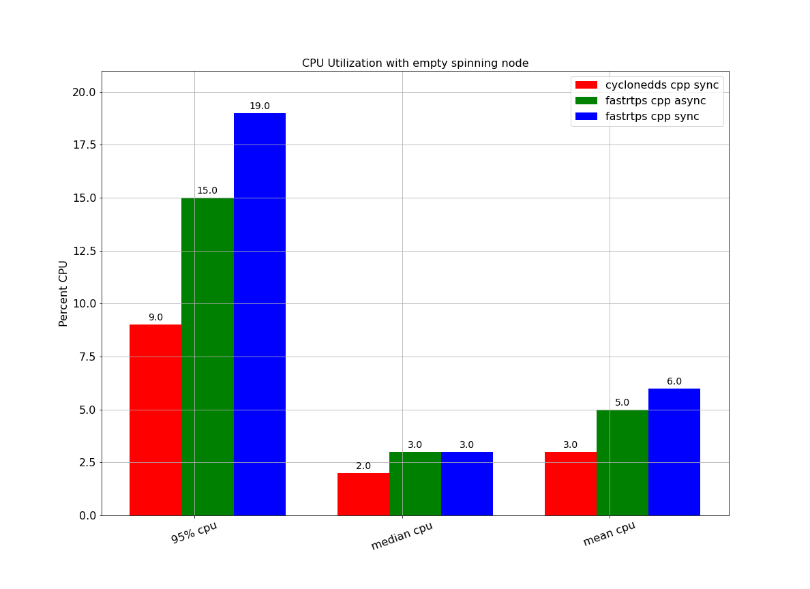


### 1.2.2 Memory Utilization in a Spinning Node By RMW

This plot shows the memory usage of a single, empty spinning node.  The node being empty means that it has no publishers, subscribers, services, actions, or timers attached.  Thus, this is a test of just the overhead of a node.

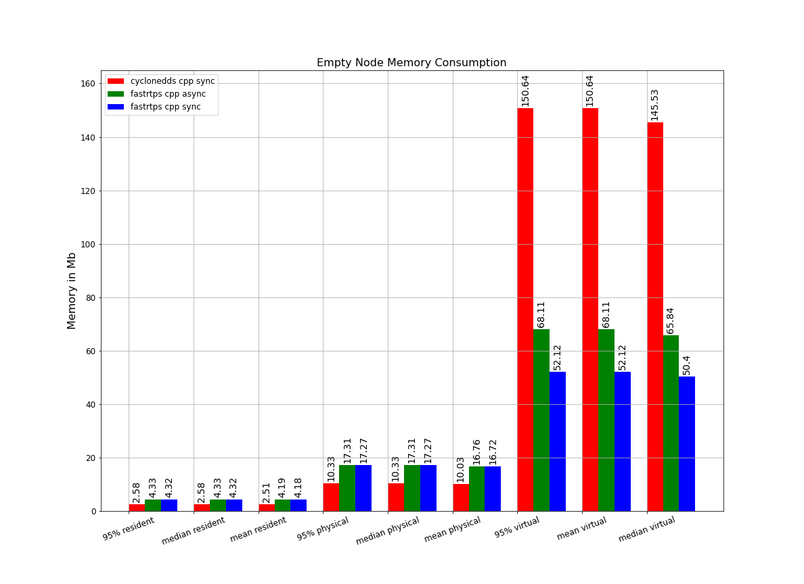

### 1.2.3: Subscriber CPU Utilization, Latency, and Lost Messages By Message Type and RMW

In this plot, 1000 messages of the specified size were sent between a publisher and subscriber on the same machine.  For each message size, the above plots show how many messages out of 1000 were received by the publisher, the average latency to receive each of the messages, and the average CPU utilization to receive the messages.  For this plot, Quality of Service options of best-effort, keep last, and a depth of 10 were used.

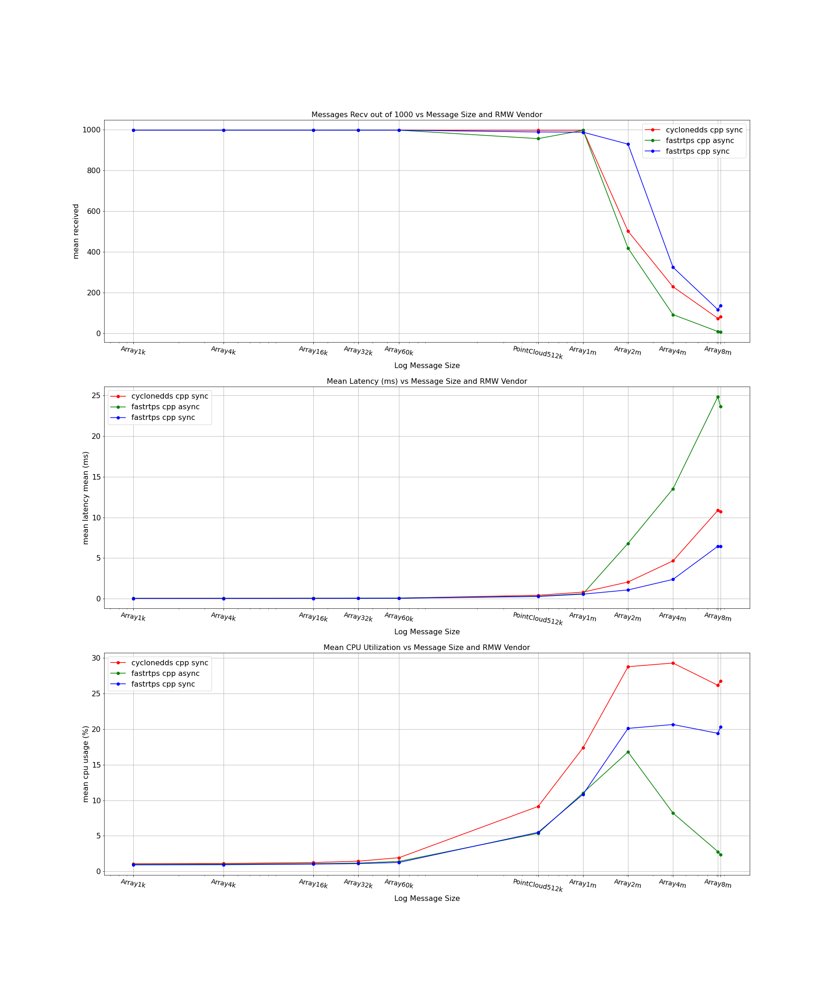

## 1.3 Build Farm Test Discussion

The results between the two RMW implementations were reasonably close, particularly in light of other RMW implementations visible on the build farm. In terms of CPU and memory utilization Cyclone DDS RMW performed slightly better. In terms of message latency and messages received both vendors appear to perform well up until approximately the 1MB message size. For messages greater than \~1MB Cyclone DDS RMW has better results with lower latency and the number of messages sent.


# <a id="Mininet"></a> 2. Mininet Simulation Results

In this section, we present some details of experiments made using [mininet](http://mininet.org/) to simulate degraded network conditions.

The priority of this section and these experiments is to highlight interesting differences in either the rmw implementations or settings that can be changed within those implementations.

The full report and data can be found here: [Appendix B](APPENDIX.md#appendix_b)

## 2.1 Synchronous Versus Asynchronous Publishing

There is a significant difference in both performance and behavior when using asynchronous publishing versus synchronous publishing.
Also, there is currently an asymmetry in the default behavior of Fast RTPS and Cyclone DDS on this point.

### 2.1.1 Overview

Briefly, the different modes dictate how publishing data is handled when the user calls something like `publish(msg)`.
In asynchronous publishing, the publish call puts the message on a queue and some significant part of sending it to remote subscriptions is done in a separate thread, allowing the publish call to return quickly and generally spend a more consistent amount of time in the publish call, especially when publishing large data where serialization, sending to the network, and other tasks could take a significant amount of time.
In synchronous publishing, the publish call does much more of the work to send the message to the network within the publish call, which is often more efficient and lower latency, but can cause issues with throughput when publishing large data and can cause the publish call to block longer than might be expected.

### 2.1.2 Current Situation

Currently Fast RTPS uses asynchronous publishing by default, but it also supports synchronous publishing as well.
Currently Cyclone DDS uses synchronous publishing, and does not support asynchronous publishing, this was reported in [this](https://github.com/ros2/rmw_cyclonedds/issues/89) issue.

A proposal was made to change Fast RTPS to use synchronous publishing by default, but it was rejected by request of the ROS 2 core maintainers (see [this](https://github.com/ros2/rmw_fastrtps/pull/343#pullrequestreview-346228522) pull request).
It is possible to change Fast RTPS to use synchronous publishing using non-portable environment variables and a custom XML configuration file, which is what is used in these experiments to generate the `Fast RTPS sync` results, versus the `Fast RTPS async` results which use the default settings.

### 2.1.3 The Possible Options

This change in behavior was blocked, in part, to avoid breaking behavioral changes between ROS distributions, i.e. one version is using async by default, and the next is using sync by default.
However, with the TSC approval, we could allow Fast RTPS to default to synchronous publishing, which would be a break in default behavior, but would bring it in line with how publishing works with Cyclone DDS.

Deciding to switch the default to Cyclone DDS is implicitly making this change in default behavior, from Fast RT{S with asynchronous publishing to Cyclone DDS with synchronous publishing.

Therefore there are three related possible outcomes from this process:

- Do nothing, keep Fast RTPS as the default, keep asynchronous publishing as the default.
- Switch to Cyclone DDS as the default, implicitly changing the publishing behavior to synchronous in the process.
- Stick with Fast RTPS, but change the default publishing mode to synchronous.

### 2.1.4 Improvements to ROS 2

Ideally we would have a portable way in the ROS 2 API for users to choose which publishing mode they want.
We should add this, but it still does not address the issue of which settings to use by default, and whether or not to breaking existing behavior by changing Fast RTPS to synchronous publishing by default.

### 2.1.5 Performance and Behavior Differences

In this subsection, we will motivate why this setting matters so much and should be considered when comparing the "out-of-the-box" behavior of Fast RTPS and Cyclone DDS, and why we should be careful when considering switching the default setting for users.

#### 2.1.5.1 Impact on Performance

Asynchronous publishing can have a positive impact on throughput when publishing large data where fragmentation is involved.

This report doesn't have very good data supporting this point, but one of the purposes of this feature is to provide better performance when publishing large messages or streaming video, see Fast RTPS's documentation as an example:

[https://fast-dds.docs.eprosima.com/en/v1.8.1/advanced.html#sending-large-data](https://fast-dds.docs.eprosima.com/en/v1.8.1/advanced.html#sending-large-data)

Also this graph from the build farm's performance dataset show how CPU utilization falls off for very large messages, even though messages received is lower than synchronous in this example:


It is likely that customization of a flow controller is also required to get the optimal large data performance when used with asynchronous publishing.

Aside from the potential benefits of asynchronous publishing in certain situations, it is clear that comparing synchronous publishing in Cyclone DDS with asynchronous publishing in Fast RTPS is not a fair comparison.
The "Messages Recv" part of the graph above demonstrates this, by showing that the sync mode for the two implementations have the same curve shape and are close in performance, whereas the asynchronous mode diverges from the other two.

#### 2.1.5.2 Impact on Publish Behavior

In a situation where the bandwidth required for publishing exceeds the available bandwidth you can observe a difference in publish blocking behavior.
We emulate this situation by using mininet to limit the bandwidth artificially.

To illustrate this difference in behavior consider this experiment case:

- a single publisher publishing a "PointCloud512k" at 30Hz to a single subscription in a separate process,
- using the QoS:
  - reliable,
  - volatile, and
  - keep last with a history depth of 10, and
- using mininet to limit the bandwidth to 54Mbps.

This case is interesting because the required bandwidth exceeds the limit imposed by mininet, i.e. the message is roughly 512 kilobytes being published at 30Hz, so a rough calculation is that it would require 122Mbps to transmit all of the data (not including the overhead of transport or resent data).

In this scenario, a backlog of messages is produced and the history cache is full in the first few seconds of publishing.

To understand this point, it is also important understand how the "Messages Sent" is calculated by the publishing process.
Each time a message is published, a time stamp is recorded, the remaining time until the next publish period is calculated and the publishing thread sleeps until that time has elapsed before publishing again.
So if publishing takes a long time it can begin to impact the effective publish rate.

Consider these two series of plots comparing `Fast RTPS sync` and `Cyclone DDS sync` with varying packet loss:

<table>
  <tr>
    <td></td>
    <td>Cyclone DDS sync</td>
    <td>Fast RTPS sync</td>
  </tr>
  <tr>
    <td>Packet Loss: 0%</td>
    <td>
      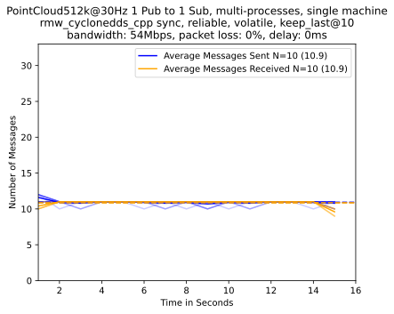
    </td>
    <td>
      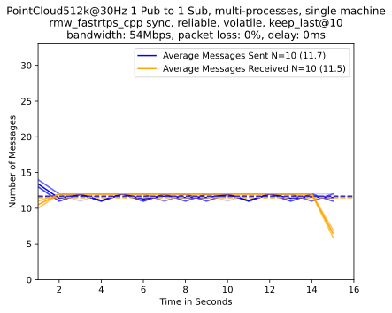
    </td>
  </tr>
  <tr>
    <td>Packet Loss: 10%</td>
    <td>
      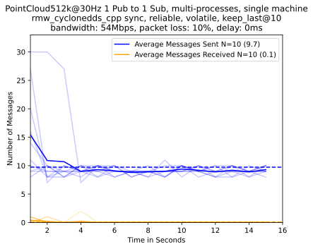
    </td>
    <td>
      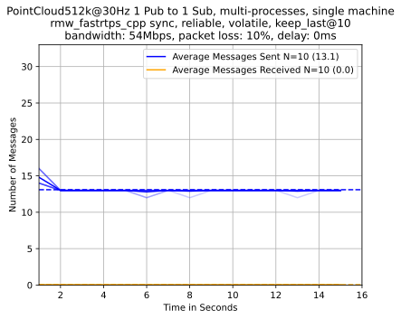
    </td>
  </tr>
  <tr>
    <td>Packet Loss: 20%</td>
    <td>
      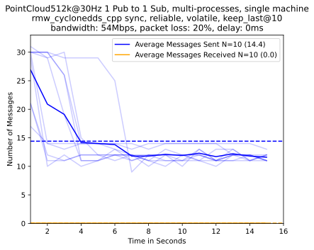
    </td>
    <td>
      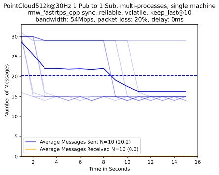
    </td>
  </tr>
  <tr>
    <td>Packet Loss: 30%</td>
    <td>
      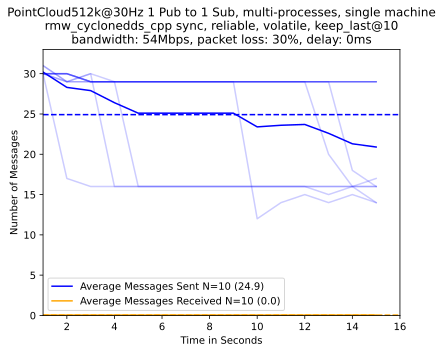
    </td>
    <td>
      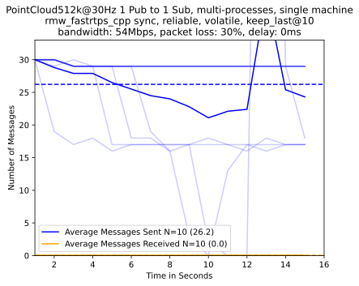
    </td>
  </tr>
  <tr>
    <td>Packet Loss: 40%</td>
    <td>
      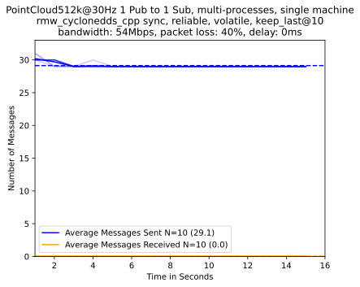
    </td>
    <td>
      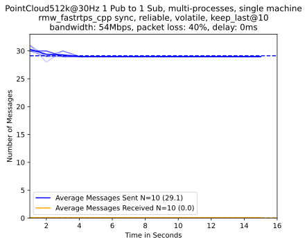
    </td>
  </tr>
</table>

As you can see, the publishing rate does not meet the target of 30 per second, but are fairly consistent between the two implementations.

An oddity is that as the packet loss increases, the effective publishing rate increases as well, approaching the desired rate of 30.

Note that these plots show both individual runs (with reduced alpha) and averages of those 10 runs (solid lines).
The dotted lines are averages rates for the entire run.

Now consider these two series of plots between `Fast RTPS async` and `Fast RTPS sync`:

<table>
  <tr>
    <td></td>
    <td>Fast RTPS async</td>
    <td>Fast RTPS sync</td>
  </tr>
  <tr>
    <td>Packet Loss: 0%</td>
    <td>
      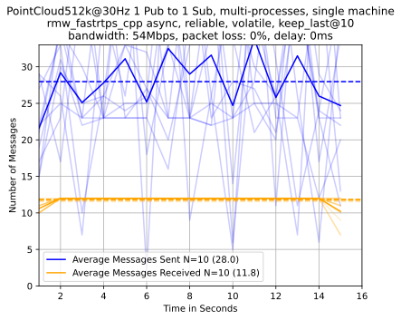
    </td>
    <td>
      
    </td>
  </tr>
  <tr>
    <td>Packet Loss: 10%</td>
    <td>
      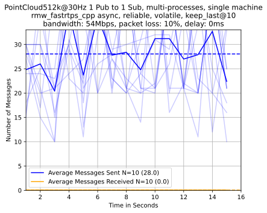
    </td>
    <td>
      
    </td>
  </tr>
  <tr>
    <td>Packet Loss: 20%</td>
    <td>
      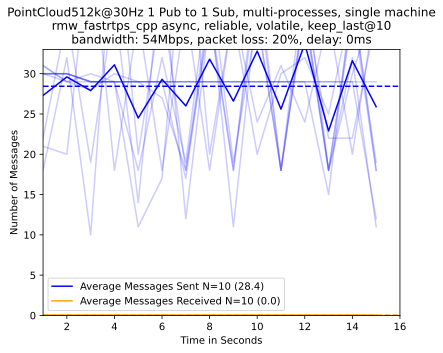
    </td>
    <td>
      
    </td>
  </tr>
  <tr>
    <td>Packet Loss: 30%</td>
    <td>
      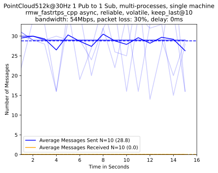
    </td>
    <td>
      
    </td>
  </tr>
  <tr>
    <td>Packet Loss: 40%</td>
    <td>
      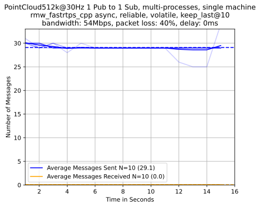
    </td>
    <td>
      
    </td>
  </tr>
</table>

Notice in the async case that the publish rate almost achieves the desired 30Hz, whereas the publish rate for sync is clamped to the capacity of the network almost immediately.
The publish rate for async is quite noisy, which is something we could investigate further, but the average is quite close the desired goal.

This can be a very serious issue if the user's code is designed under the assumption that publishing is always relatively quick, which is a likely assumption for ROS 1 users (ROS 1 behaved most similarly to asynchronous publishing in ROS 2) or for users thinking that "keep last" will just replace messages in the history cache if there's a backlog.
We can document this behavior, but the impact is quite subtle and could lead to hard to diagnose problems in user's applications.

This example was intended to demonstrate why it is important to be cautious when changing this behavior for all users.

## 2.2 Mininet test results

### 2.2.1 Experiments with Lost Packets or Latency at 54Mbps Bandwidth

This plot shows several poorly performing cases with the mininet bandwidth set at 54Mbps.  Each label across the X-axis describes the simulated packet loss percentage and the size of the message.  For example, "L:0/PointCloud512k" shows the results from simulating 0% packet loss with a 512k message size and 54Mbps bandwidth cap.  The top plot shows the mean latency to receive the messages, while the bottom plot shows what percent of the messages were lost.  It should be noted that only poorly-performing cases are illustrated here; see [Appendix B](APPENDIX.md#appendix_b) for all of the data, including the successful ones.  For this plot, Quality of Service options of reliable, keep last, and a history depth of 10 were used.

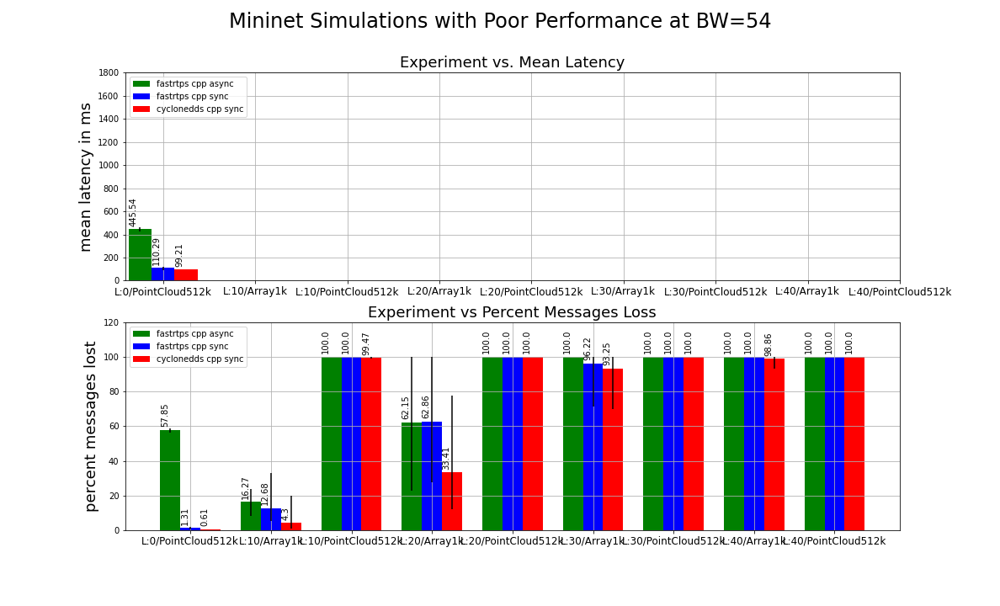

### 2.2.2 Experiments with Lost Packets or Latency at 300Mbps Bandwidth

This plot shows several poorly performing cases with the mininet bandwidth set at 300Mbps.  The rest of the description in 2.2.1 applies to this plot as well.

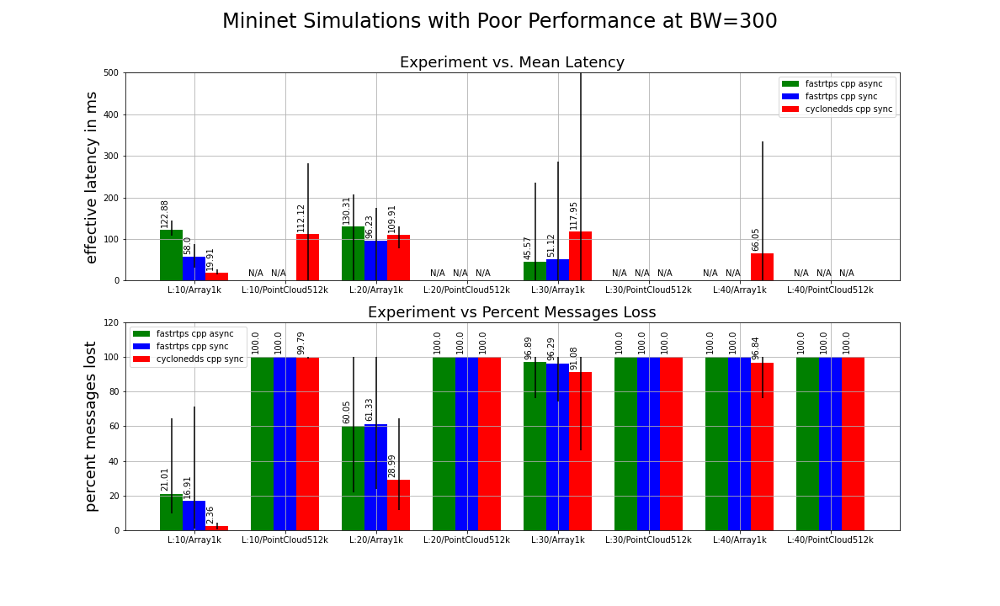

### 2.2.3 Experiments with Lost Packets or Latency at 1000Mbps Bandwidth

This plot shows several poorly performing cases with the mininet bandwidth set at 1000Mbps.  The rest of the description in 2.2.1 applies to this plot as well.

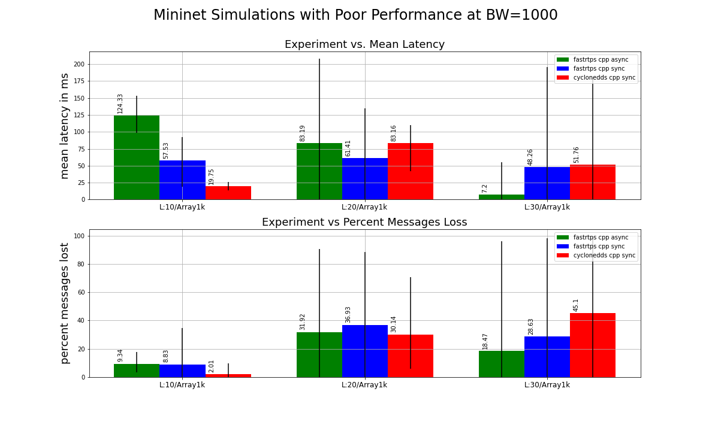


### 2.2.4 Publisher and Subscriber Memory and CPU Consumption for Select Experiments

The plot below gives the average of ten Mininet experiments for both memory and
CPU consumption broken down by publisher and subscriber. In this case we're
using a configuration where the network bandwidth was limited to 54Mb and a
message size of 512k. The results are fairly representative; with no clear
winner in terms of CPU consumption, and slightly better memory consumption
across the board for `Cyclone DDS sync`. The complete set of bandwidth and message size
permutations are available in [Appendix B](APPENDIX.md#appendix_b).


# <a id="WiFi"></a> 3. WiFi Results

## 3.1 Test scenario

To test the performance and behavior in a real world scenario we tested the
communication over WiFi.
For the test two laptops were used which were connected to a 2.4 GHz network
provided by an ASUS RT-AC86U.
The goal was to push the transmitted bandwidth to the limit and observe the
performance and behavior of the RMW implementation since this was a common pain
point reported by users.

A single topic with **Array60k** messages was used with the following QoS
settings:

* Reliability: reliable
* History: keep latest with a queue depth of 10

## 3.2 Test invocation

On each side the *perf_test* executable from the
[performance_test package](https://github.com/ros2/performance_test/) was
invoked with the following configuration:

* The environment **RMW_IMPLEMENTATION** was set to the RMW implementation
* The option **-c ROS2** to test the RMW implementation rather than the native
  API
* The option **-t Array60k** for the specific message type to send / received
* The option **--max_runtime 30** to run the publisher / subscriber for 30s
* The option **--ignore 1** to ignore the first second of statistics
* The option **--reliable --keep_last --history_depth 10** to configure the QoS
* The option **-s 0** for the publisher / **-p 0** for the subscriber
* The option **-r 80** / **-r 100** / **-r 120** for the publishing frequency in
  Hz
* Piping the result into a file with the following pattern:
  **\<RMW>-\<SIDE>-\<FREQ>-\<RUN>.txt**

  * **\<RMW>**: either **f** for Fast RTPS or **c** for Cyclone DDS
  * **\<SIDE>**: either **p** for the publisher side or **s** for the subscriber
    side
  * **\<FREQ>**: the frequency in Hz which was either 80, 100, or 120
  * **\<RUN>**: the index of the run, which we performed 10 of each

The output of all test runs can be found [here](./galactic/data/wifi).

## 3.3 Test results

| Fast RTPS                                               | Cyclone DDS                                               |
| -                                                       | -                                                         |
| 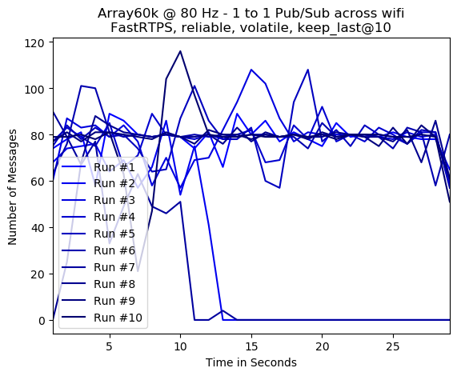  | 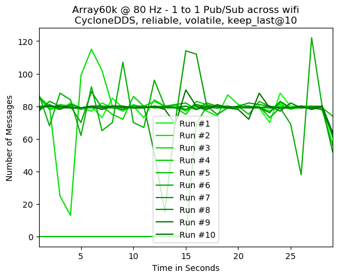  |
| 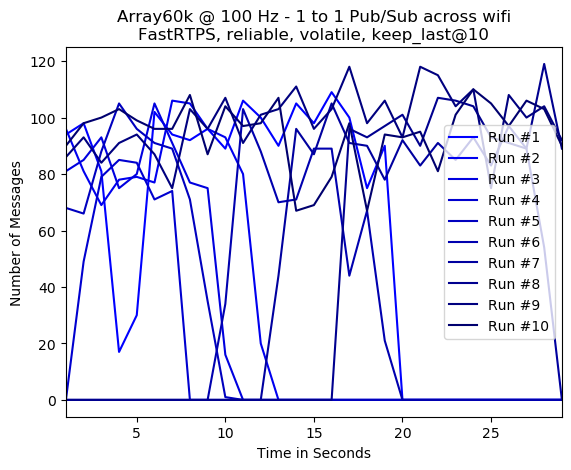 | 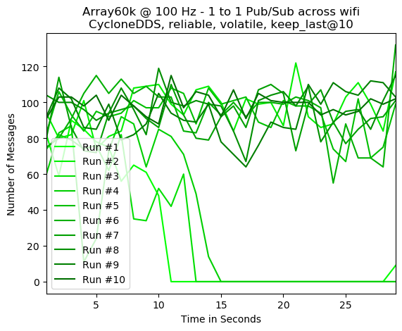 |
| 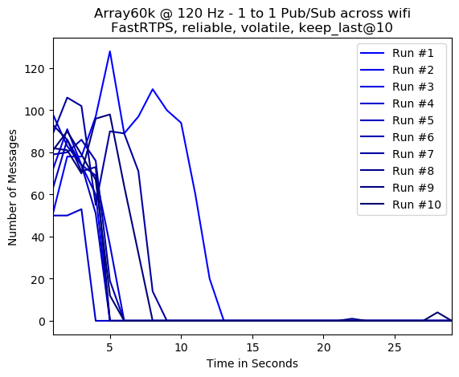 |  |

## 3.4 Test summary

The user expectation is that when the bandwidth limit is reached that less
messages are being received than published.
But for both tested RMW implementations the higher frequency tests show that
after messages are received initially after some time no more messages are
being received anymore.


# <a id="GitHubStats"></a> 4. GitHub User Statistics

## 4.1 Overview and Statistics

Responsiveness to issues and pull requests in a GitHub repository is a good
proxy measurement for how quickly a given vendor responds to their customer and
users. The number of pull requests, and how quickly they are closed also give an
indication to how much development is taking place on a given code base and how
quickly issues are being resolved. To examine the responsiveness and development
velocity of both RMW vendors we used the github API to collect commit, pull
request, and issue data for the 180 days before the report was drafted on
10/17/2020. The process of collecting this data was divided into two part, data
collection which can be found in [this
notebook](./galactic/GetGitRMWDDSMetrics.ipynb), and data analysis which can be [found here](./galactic/PlotGithubStats.ipynb).

## 4.2 GitHub Engagement Results

### 4.2.1 Open and Closed Pull Requests in the Previous Six Months

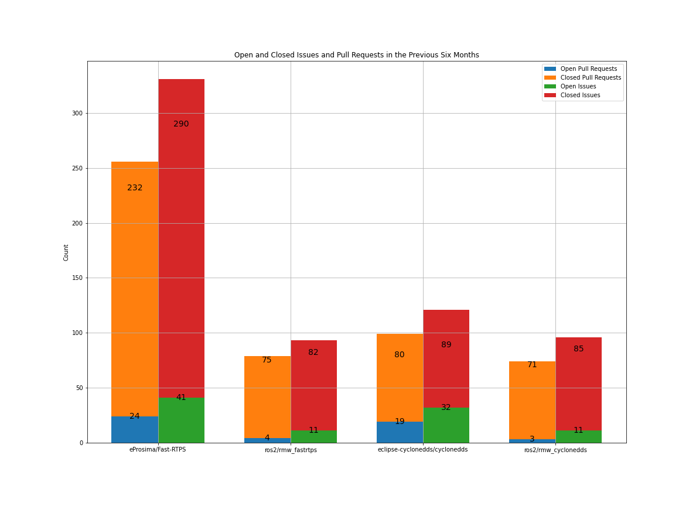

### 4.2.2 Cumulative Time to Close Pull Requests and Issues

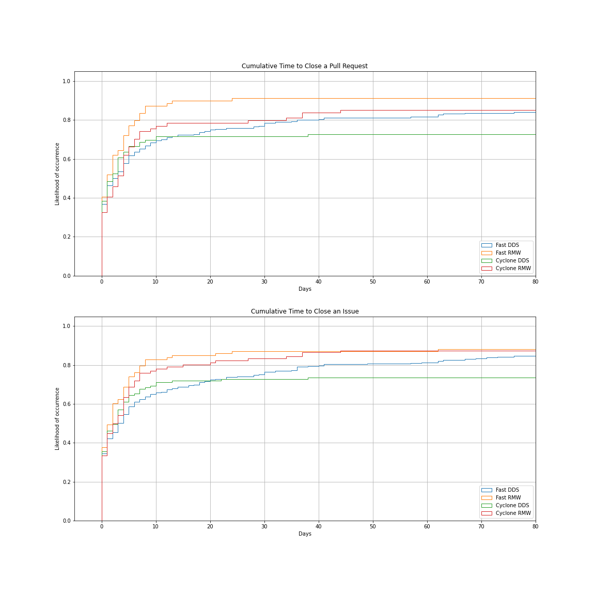

# 4.3 GitHub Metrics Discussion

Generally, for the six month period sampled, both vendors are doing a great job responding to both issues and pull requests. In terms of RMW layers the vendors have only small differences, with Fast RTPS being slightly faster closing issues and tickets for their RMW layer. Fast RTPS also appears to be under heavier development with almost three times the number of pull requests during the previous six months. It is unclear if this is caused by an increased number of ROS users, increased feature deployment, or addressing bugs and issues.

# <a id="CodeQuality"></a> 5. REP-2004 Code Quality Metrics

## 5.1 Overview and Description

Code quality is an important metric for project health.  ROS 2 has defined various levels of package quality in [REP-2004](https://ros.org/reps/rep-2004.html).  Declaring a package to be in one of those quality levels means that it meets all of the requirements for that particular quality level.  The quality level of each of the middlewares and their RMW implementation is summarized below.  For more details, the reader is encouraged to look at the corresponding source repository for each middleware or RMW, where the quality level is declared in a file named QUALITY_DECLARATION.md or similar.

## 5.2 Results

| Package/Quality Metric | [Cyclone DDS](https://github.com/ros2/rmw_cyclonedds/blob/3fa62f4f8fa9b3cc624879e9c085ad19aa9c1977/CYCLONEDDS_QUALITY_DECLARATION.md) | rmw_cyclonedds | [Fast RTPS](https://github.com/eProsima/Fast-DDS/blob/08100416cd82950cafd37ce8b34c3a0cc02b3ba2/QUALITY.md) | [rmw_fastrtps](https://github.com/ros2/rmw_fastrtps/blob/4e0fce977c993f840b013c444d603842fb39ad64/rmw_fastrtps_cpp/QUALITY_DECLARATION.md) |
| ---------------------- | ---------- | -------------- | -------- | ------------ |
| Current Quality Level  |      3     |      N/A       |    2     |     2            |
| 1. Version Policy      | 1. follows semver by major 0 is stable<br>2. current version is stable<br>3. `dds_` or `DDS_` symbols are public API, others may change<br>4. no major releases in stable allowed<br>5. no major releases in stable allowed<br>6. no major releases in stable allowed | N/A | 1. follows semver<br>2. current version is stable<br>3. API documentation [available](https://fast-dds.docs.eprosima.com/en/latest/fastdds/api_reference/api_reference.html)<br>4. no major releases in stable allowed<br>5. only minor releases break ABI<br>6. N/A | 1. follows semver<br>2. current version is stable<br>3. public API is in the headers<br>4. no major releases in stable allowed<br>5. no major releases in stable allowed<br>6. no major releases in stable allowed |
| 2. Change control      | 1. changes must be in PR<br>2. DCO required<br>3. one review for merge (except when no reviewers available<br>4. CI required to pass<br>5. documentation required | N/A | 1. changes must be in a PR<br>2. DCO required<br>3. at least one review required for merge<br>4. CI required to pass<br>5. documentation required | 1. changes must be in PR<br>2. DCO required<br>3. at least one review required for merge<br>4. CI required to pass<br>5. documentation required |
| 3. Documentation       | 1. no high-level/concept documentation<br>2. API docs are embedded in the code<br>3. Eclipse Public License 2.0/Eclipse Distribution License 1.0<br>4. copyright statement included with the code | N/A | 1. all features are documented<br>2. API reference is hosted at [readthedocs](https://fast-dds.docs.eprosima.com/en/latest/fastdds/api_reference/api_reference.html)<br>3. Apache 2.0 license<br>4. copyright statement included with the code | 1. all features are documented<br>2. API docs are embedded in the code<br>3. Apache 2.0 license<br>4. copyright statement included with the code |
| 4. Testing             | 1. system tests cover features<br>2. tests cover all of the public API<br>3. line coverage should increase with changes<br>4. no performance tests<br>5. uses coverity for static analysis | N/A | 1. simulation tests cover features<br>2. tests cover typical usage of public API<br>3. best-effort line coverage increase with changes<br>4. automatic performance test on changes<br>5. uses linters, but only for new code | 1. system tests cover features<br>2. tests cover all of the API<br>3. line coverage should increase with changes<br>4. no performance tests<br>5. uses standard ROS linters and tests |
| 5. Dependencies        | 1. no ROS dependencies<br>2. no ROS dependencies<br>3. OpenSSL external dependency | N/A | 1. no ROS dependencies<br>2. no ROS dependencies<br>3. libasio, libtinyxml2, Fast CDR, foonathan_memory, and OpenSSL* external dependencies | 1. all direct runtime ROS deps at some level<br>2. no optional direct runtime ROS deps<br>3. Fast CDR/Fast RTPS claim to be at QL 2 |
| 6. Platform            | 1. supports all ROS 2 Tier 1 platforms | N/A | 1. supports all ROS 2 Tier 1 platforms | 1. supports all ROS 2 Tier 1 platforms |
| 7. Security            | 1. conforms to [REP-2006](https://ros.org/reps/rep-2006.html) | N/A | 1. [Vulnerability disclosure policy](https://github.com/eProsima/policies/blob/main/VULNERABILITY.md) | 1. Conforms to [REP-2006](https://ros.org/reps/rep-2006.html) |


\* OpenSSL dependency for Fast RTPS is optional, but used in ROS 2.

## 5.3 Discussion

rmw_cyclonedds_cpp is missing a quality declaration making it difficult to perform an apples to apples comparison between the two. Under most of the categories for the parts that are documented each implementation are comparable. Despite this there is an appreciable difference as Cyclone DDS is currently declared as quality level 3, and Fast RTPS is rated as quality level 2.

# <a id="Survey"></a> 6. User Survey Results

## 6.1 Overview and Description

The final component of this document is a user survey on ROS user’s feelings about their selected RMW implementation conducted between September 17th and October 16th 2020. The survey was posted to ROS Discourse and provided ROS 2 users with a chance to rate the performance of their RMW as well as give a narrative description of their experience. In conjunction with this evaluation data we also asked participants to provide basic demographic data and perform a self assessment of their skills. In total there 96 responses with 31 users reporting that they use Cyclone DDS RMW and 60 users reporting they use Fast RTPS RMW. All of the respondents were ROS 2 users with nearly three quarters of them presently working with ROS 2 Foxy. The users sampled come from a wide variety of backgrounds, industries and work on a variety of different projects.

In the following section we summarize the data and where possible provide the descriptive statistics for both RMWs as well for the ROS community. Section 5.1.1 summarizes the questions given to participants that are referenced by the plots in 5.2. There is summary of the results in 5.3 with a selection of user narrative responses included in section 5.4

## 6.1.1 Survey Question Summary

Survey participants were asked a total of nineteen questions related to their
RMW experience, which each of the questions listed below along with a question
number to reference them in the graphs in section 5.2. Survey participants were
allowed to respond with one of the following: "Strongly Agree", "Agree",
"Neutral", "Disagree", "Strongly Disagree", and "Not Applicable". For plotting
the results the written scores were translated to numerical values with,
"Strongly Agree" being given a score of 5, and "Strongly Disagree" being given a
score of 1. Users who selected "Not Applicable" were not included in the final
results.


- Q1: My current RMW worked out of the box for my application.
- Q2: I understand how RMWs work.
- Q3: I am capable of changing my RMW easily.
- Q4: I would/have considered changing my RMW implementation.
- Q5: Open Robotics provides sufficient information for me to make a sound RMW selection.
- Q6: My current RMW implementation provides sufficient support.
- Q7: My current RMW implementation provides sufficient  documentation.
- Q8: My current RMW implementation provides sufficient debugging tools.
- Q9: My current RMW implementation provides sufficient features for my application.
- Q10: My current RMW implementation provides sufficient performance for my application.
- Q11: I am considering or have considered changing my current RMW implementation due to technical challenges.
- Q12: DDS/RMWs have improved the overall ROS experience.
- Q13: I would advocate for my current RMW to be the default ROS 2.
- Q14: I would recommend my current RMW to a friend.
- Q15: My RMW interoperates well with other systems.
- Q16: Based on the out-of-the-box experience I would recommend ROS2 Foxy to a friend.
- Q17: ROS should continue to use DDS as the default RMW implementation.
- Q18: I consider my current RMW implementation robust, reliable, and ready for production.

## 6.2 RMW User Survey Results

### 6.2.1 Survey Participant Demographic Information

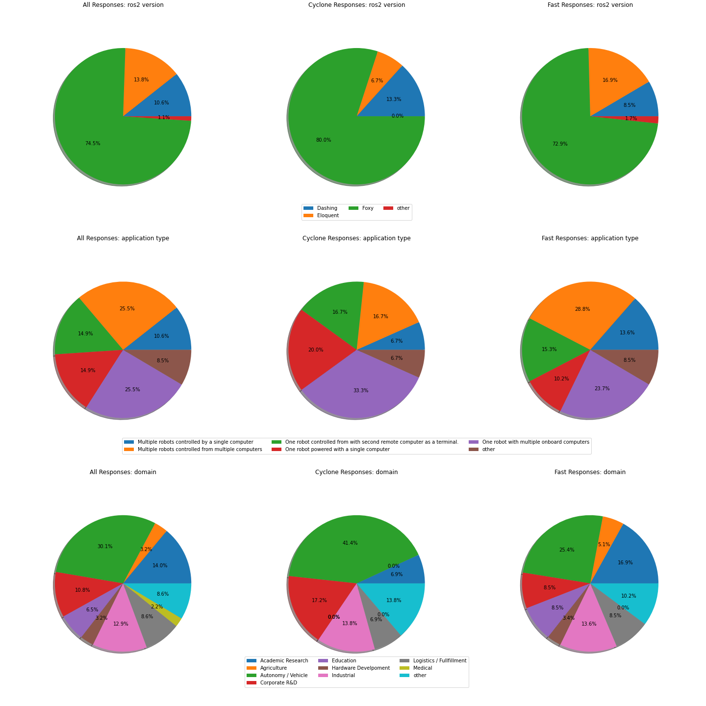

### 6.2.2 Survey Participant Skill Self Assesment

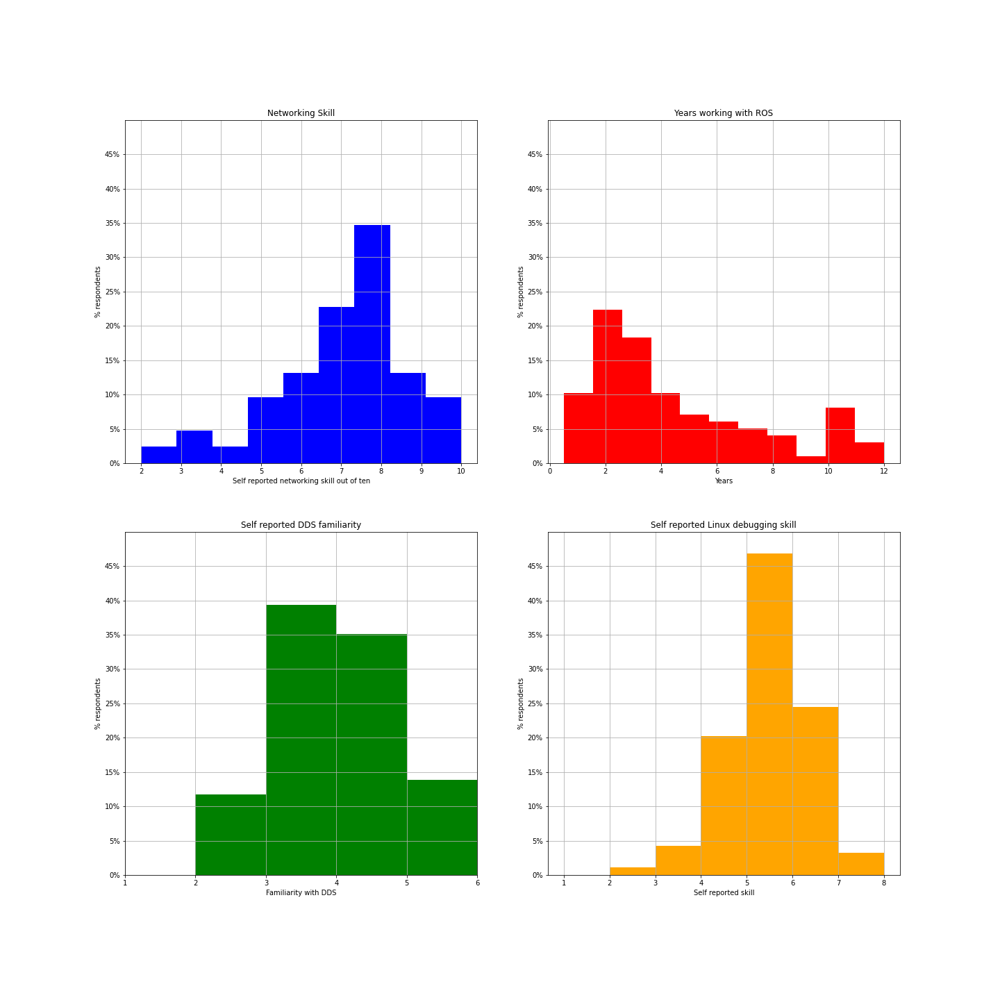


### 6.2.3 Survey Response Data by RMW

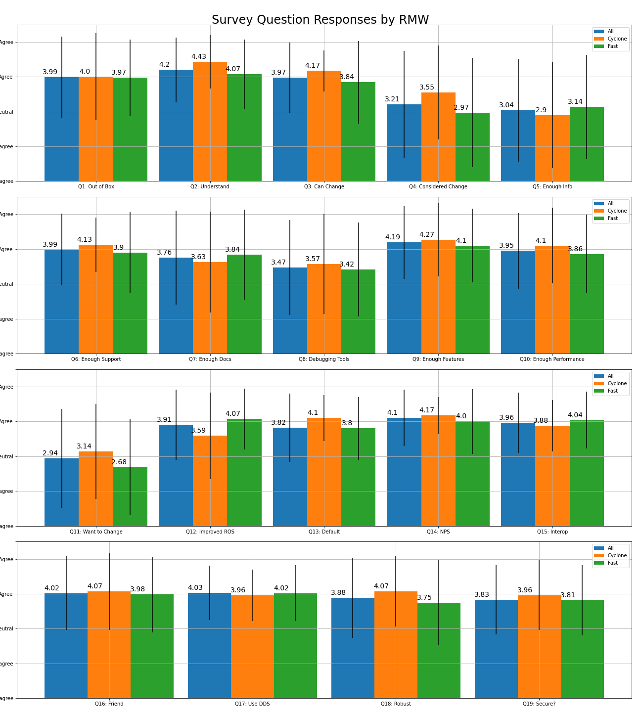


### 6.2.4 Survey Question Drill Down 1

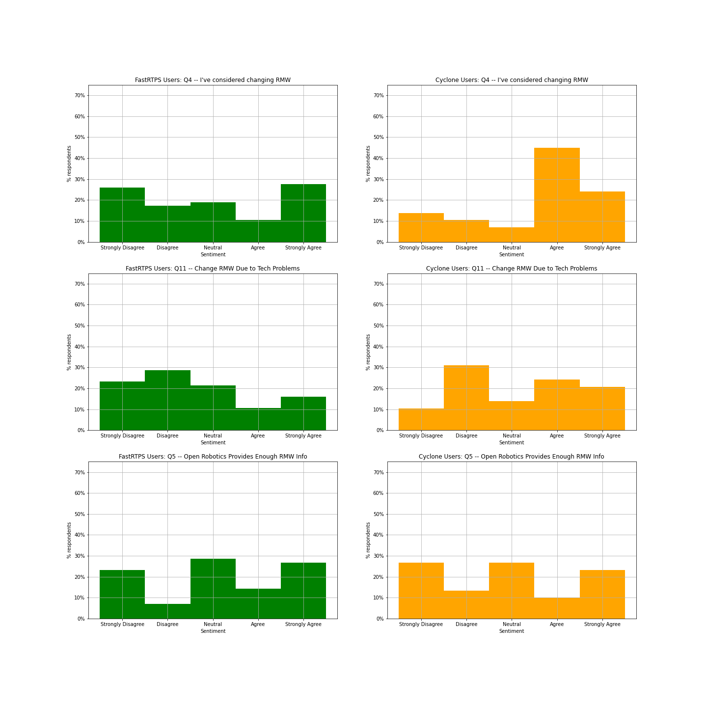


### 6.2.5 Survey Question Drill Down 2

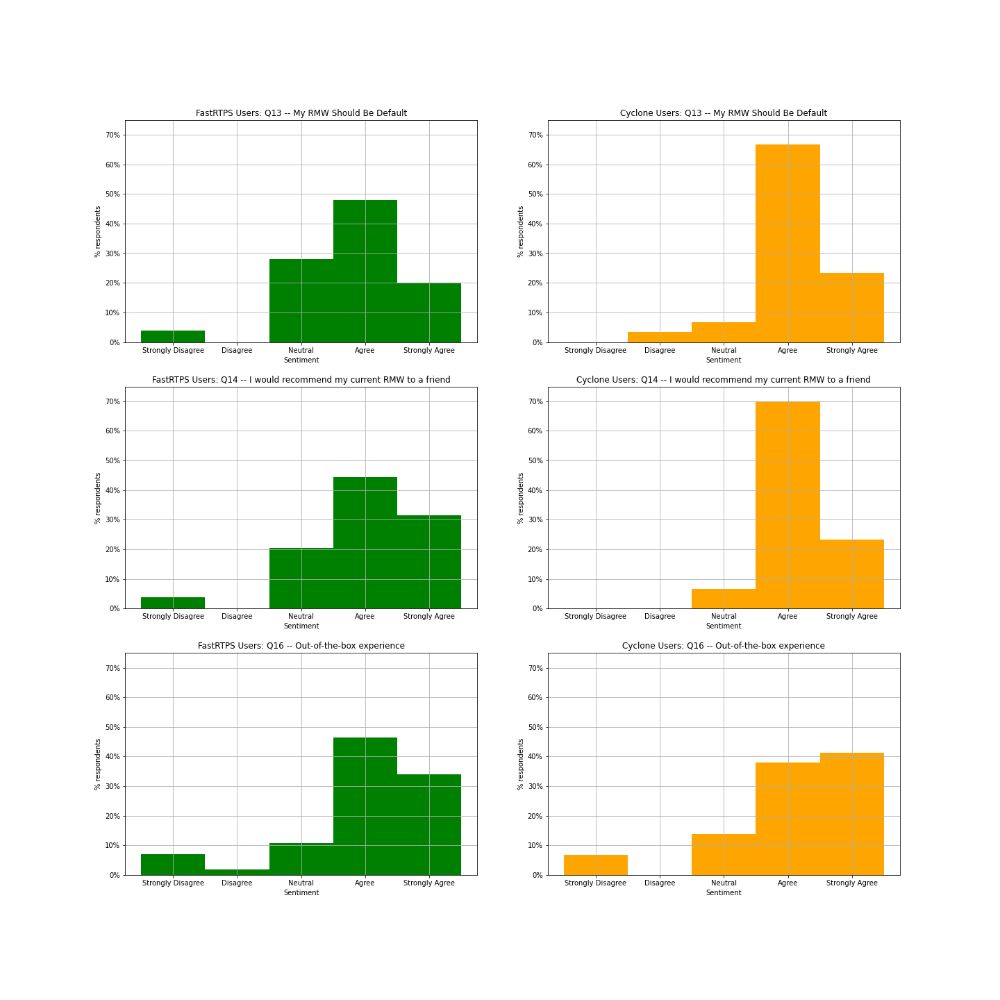


## 6.3 Survey Discussion

We feel that we were able to collect a large and representative sample of the ROS community for this survey with a sufficient number of users for each RMW included in the final report. The respondents to the survey represent a wide swath of ROS 2 users with the preponderance of responses coming from ROS 2 Foxy Fitzroy users. These respondents reported a wide range of skill levels and varying degrees of competency in debugging, networking, and ROS development skills. What is remarkable about the responses is how uniform they were on most questions relating to their selected RMW vendor. The difference between most of the responses varies by no more than 5% for most of the questions.

Questions one, two, and three are leader questions that help us understand the ROS 2 community’s understanding of ROS middleware. By and large ROS 2 users, using both RMWs, say that they understand how RMWs work, how to change them, and that their current RMW worked out of the box for them. However, Cyclone DDS RMW users are slightly more likely to understand RMWs. Question four asks if a given user has changed their RMW, and unsurprisingly Cyclone DDS RMW users are much more likely to have considered changing their RMW. Question five, “Does Open Robotics provide sufficient information to make a sound RMW selection” received on average a neutral response indicating we could do more to support the community. For questions six, seven, and eight, most users, from both RMWs, feel they have sufficient support, documentation, and debugging tools. Question nine asks if the selected RMW has sufficient features, and Cyclone DDS RMW users believe it performs slightly better in this category.

Question ten shows that Cyclone DDS RMW users believe that they have sufficient performance for their application, but the difference is small, only 6%.
Question eleven, “I am considering changing or have changed my RMW due to technical challenges” is interesting because the responses are nearly uniform between the two RMWs. In question twelve we find that ROS users generally agree that DDS RMWs have improved the overall ROS experience. Question thirteen asks respondents if they would recommend their RMW as the default, to which Cyclone DDS RMW users have a more positive response. Similarly, question fourteen asks is the user would recommend their RMW to a friend, and a slightly higher percentage of Cyclone DDS RMW users would do so. This question is very similar to the “net promoter score” used by product managers to understand customer attitudes towards a product.  Most of the remaining questions are fairly similar results except for question eighteen, “I consider my current RMW implementation robust, reliable, and ready for production.” Question eighteen had a slightly higher positive response rate from Cyclone DDS RMW users.

All in all, Cyclone DDS RMW rated more favorably among its users, but only very slightly so.

## 6.4 Survey Narrative Responses

We provided a space in the user survey for respondents to communicate their feelings about their preferred middleware to the TSC, While not a formal evaluation, the experience of individuals is worth considering given our limited testing capabilities. The full list of responses will be provided to the TSC if requested. We have included a few of these excerpts in this document to capture the spirit of all the responses.


### 6.4.1 Cyclone DDS User Responses

```
“CycloneDDS has been more consistent with outputting the expected
performance. The test we ran show that in many different scenarios CycloneDDS is
able to work without a hitch, while Fast DDS's performance outperforms
CycloneDDS in some scenarios it completely fails in others (100+ nodes in a
distributed setup over VPN).”

	                                      -- A ROS 2 Foxy user
```


```
“Right now, I would advocate for Cyclone DDS, with FastDDS still being a
relatively close second. I think FastDDS works for most users in most use-cases,
particularly users who may not be working in commercial/industrial environments,
such as university labs or personal projects, but I have had both performance
and reliability issues with it relating to discovery, implementation of DDS
features, sending of large-data, and more, which Cyclone fully resolved for
me. License-wise, they are both agreeable options.”

	                                      -- A ROS 2 Foxy user
```


``` markdown
“CycloneDDS is the best. Only CycloneDDS can remote use rviz2 over Wi-Fi to
 control the AMR doing navigation with Navigation2.”

	                                      -- A ROS 2 Foxy user
```


```
“I would definitely advocate for a default RMW (and even further for only a
single supported RMW). As for which one, I don't have a strong opinion, but I
would be biased to cyclonedds simply because they seem extremely willing to
engage with the community and to be responsive to its needs.”

	                                      -- A ROS 2 Foxy user
```

### 6.4.2 Fast RTPS Narrative Responses

```
“I am lacking the technical knowledge of the RMW details for a decision like that.
All I can say is that the default didn't work well at all for our use case.”

                                          -- A ROS 2 Eloquent user
```

```
“I would vote positively for the current one, in fact I'have gone through their
documentation (Fast DDS, XRCE DDS and Integration Service) besides the official
ROS documentation. To me, the integration service is being quite useful to promote
the acceptance of ROS2 features. I am familiar with this stuff and I am not willing
to experience changes on this part of my systems.”

                                          -- A ROS 2 Foxy user
```

```
“Cannot advocate for a particular RMW, as we only used the default one. However, we
never had any trouble with it, and we prefer it that way. Should the default RMW change,
we would consider configuring our solution to use the current one, as we already know it
works for us.”

                                          -- A ROS 2 Foxy user
```

```
“I advocate for FastDDS (formerly FastRTPS) from eProsima. I think their implementation
works great for most of the situations. Also, they have a full and large team dedicated
to develop and improve it. Finally, they have specialised services for companies that need
extra development on top of that. And it is open source”

                                          -- A ROS 2 Eloquent user
```
