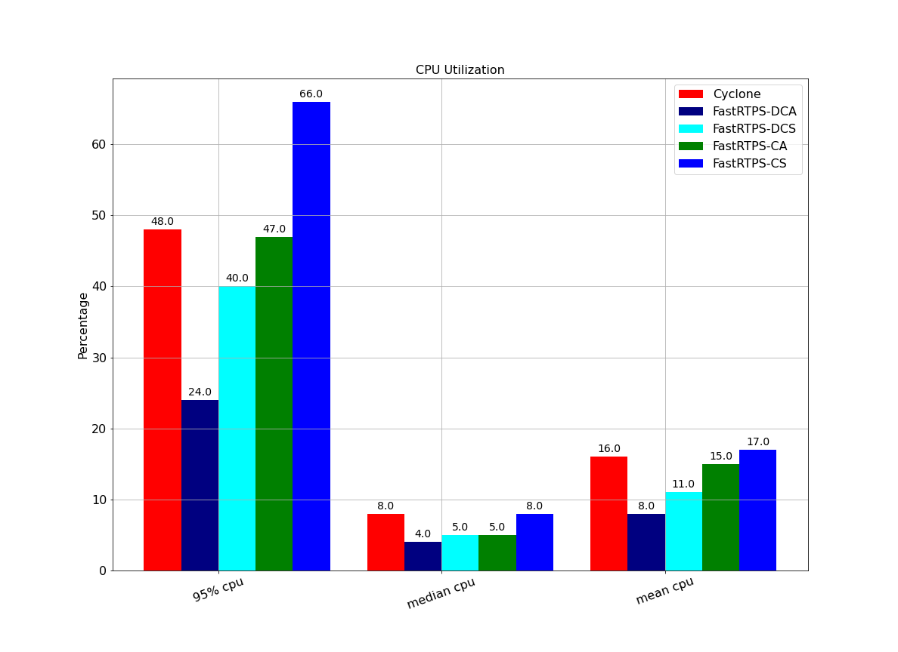

# Appendices and Supporting Materials

##  Appendix A: Full Build Farm Plots

For completeness we have provided all data available on the build farm; this includes data from Cyclone DDS, Connext DDS, and four variants of FastRTPS available on the buildfarm. The four available variants of Cyclone DDS include both dynamic and static memory variants along with two asynchronous and synchronous variants. Not all tests included all variants but we have included what data was available. These plots compare the four variants of FastRTPS were used during testing, dynamic C++ asynchronous (abbreviated DCA), C++ static (abbreviated CS), dynamic C++ synchronous (abbreviated DCS), and asynchronous C++ (abbreviate CA). One variant of Cyclone RMW was tested, which is the C++ static version.

