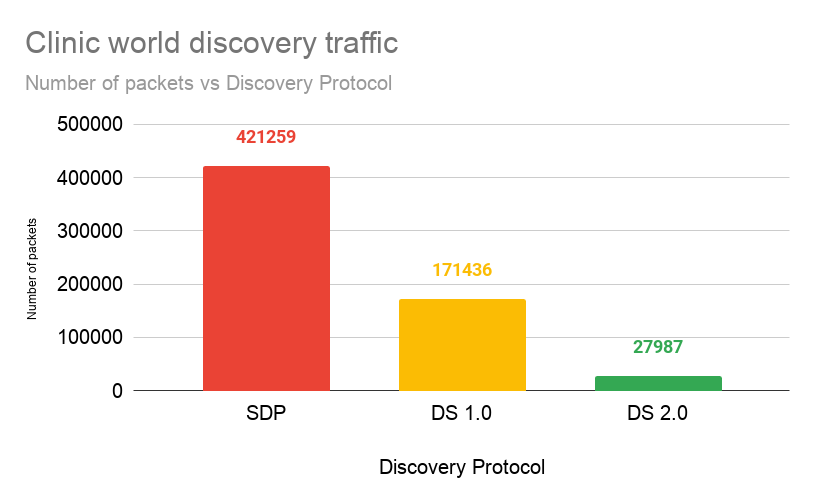
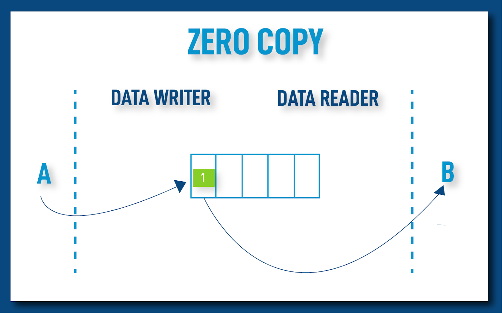
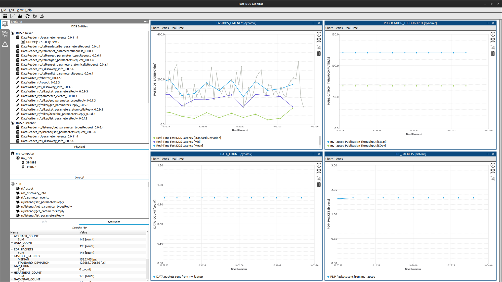
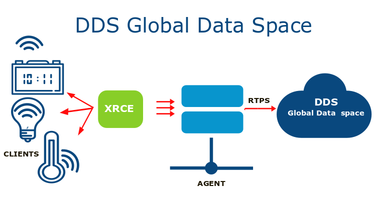

# Fast DDS TSC RMW report 2021

* [Performance](#performance)
* [Services](#services)
* [WiFi](#wifi)
* [Features](#features)
* [Benchmarking](#benchmarking)
* [Free form: About Fast DDS](#free-form-about-fast-dds)

## Performance

We consider this whole section should have been entrusted to a neutral third party.
That is why, apart from our full range of performance tests, we asked Sony to perform their own testing.
The results can be found [here](sony-test-results/ROS-2_Fast-DDS_interprocess_performance-test-result.pdf).

**We also consider that focusing only on the performance of certain use cases is not the best approach. There is a large set of ROS 2 applications, with very different requirements in terms of data sizes, topics, number of nodes and publication rates. In most of the proposed tests the differences are not significant. However, having the ability to adapt the RMW behavior to so many use cases seems more critical. Please, refer to the section [about Fast DDS](#about-fast-dds) to learn about all the feature comparison between Fast DDS and Cyclone DDS.**

The complete description of the benchmark executed on Fast DDS can be found on section [Benchmarking](#benchmarking).
The answers to these questions are taken from the result of this benchmark.

### Without configuration, what is the throughput and latency (in addition to any other relevant metrics) when transferring large topics (like ~4K camera images) at medium frequencies (~30Hz)?

We are taking the results from the tests with 2MB data size and 30 Hz from our [Benchmarking](#benchmarking). The following table compares the average latencies of Fast DDS and Cyclone DDS implementations with default configurations on inter-process and intra-process deployments:

|          | Inter-process | Intra-process |
|-|-|-|
| Fast DDS | 2.79867 ms   | 1.05944 ms    |
| Cyclone DDS  | 6.114223 ms   | 1.70604 ms   |

Bear in mind that by default Fast DDS uses asynchronous publishing, while Cyclone DDS uses synchronous publishing. **Having asynchronous publishing by default has the advantage of preventing a blocking behavior in the write operation, which is usually considered critical in many ROS 2 applications**. Refer to [this post](https://discourse.ros.org/t/rmw-fast-dds-publication-mode-sync-vs-async-and-how-to-change-it/17153) for further information. **If any application is sensitive to the latency, it can still reduce it using Fast DDS with synchronous publishing**, that obtains yet lower latencies:

|          | Inter-process | Intra-process |
|-|-|-|
| Fast DDS (sync) | 2.56477 ms   | 0.9638ms    |
| Cyclone DDS  | 6.114223 ms   | 1.70604 ms   |

With the default configuration and the given size and frequencies, none of the implementations saturate the throughput.
In order to get throughput values, we increased the rate to 1000 messages per second.
Here we can see that Fast DDS has much better response than Cyclone DDS in terms of throughput:

* For a single subscriber on inter-process deployments, Fast DDS gets more than **double** the throughput.
* Even though both implementations are able to keep the maximum publication rate in intra-process
deployments with a single subscriber, Cyclone DDS's throughput degrades rapidly with increasing number of subscribers (see following questions).

|          | Inter-process | Intra-process |
|-|-|-|
| Fast DDS | 1999 MBps     | 2000 MBps     |
| Cyclone DDS  | 822 MBps      | 2000 MBps     |

### Without configuration, how does the implementation scale with the number of topics in the system?

Fast DDS seems to be rather unaffected by the number of topics, maintaining similar performance than with a single topic. Cyclone DDS however increases about 5% latency with each added topic.

### Without configuration, how does the implementation scale with the number of nodes in the system?

Regardless of the implementation, performance degrades mostly with the number of nodes subscribed to the same topic.
It is expected that the latency increases and that the throughput decreases with the number of subscribers.
However, the throughput with Fast DDS is much less affected than with Cyclone DDS.

 * On inter-process deployments, Fast DDS still gets **double** the throughput than Cyclone DDS. This difference is increased with the number of nodes.
 * On intra-process deployments, throughput in Fast DDS is almost unaffected by the number of subscribers up to 10 subscribers by topic, increasing only 1% with each new subscriber. In Cyclone DDS however, it increases 10% with each subscriber.
 * On intra-process deployments, Cyclone DDS's throughput is affected much earlier than in Fast DDS. Fast DDS is still able to keep the expected publication rate of 2000 Mbps with 10 subscribers, but Cyclone DDS clearly cannot keep up and it degrades to around 700, one third of the required throughput.

### Please provide benchmarks for inter-host, inter-process (with and without LoanedMessages), and intra-process (with and without LoanedMessages) throughput for both large and small message sizes, on both Linux and Windows.

For a complete description of the benchmark and the resulting conclusions, see section [Benchmarking](#benchmarking).

Note that we had trouble collecting inter-machine data with Cyclone DDS implementation, since Cyclone DDS selects only one of the available network interfaces for the communication. In our tests this resulted in Cyclone DDS selecting some virtual interface that was not connected to any physical interface. As a result, we got no communication between the processes. Although this can be corrected through configuration, we had no time to repeat the whole benchmark and, thus, we have no data to characterize Cyclone DDS on inter-machine deployments.

Also note that Fast DDS uses Boost.interprocess to implement shared memory and data sharing deliveries. While performance results for Fast DDS on Ẅindows were similar to other platforms on Windows 10 Version 21H1 (May 2021 Update), a recent Windows patch changed the behavior of Boost.intraprocess. This results on bad performance of Fast DDS on updated Windows platforms. Undefining `BOOST_INTERPROCESS_FORCE_GENERIC_EMULATION` on Boost.interprocess restores the previous behavior, which are the results we are presenting here.

### For a pub/sub pair in separate processes, what is the average round-trip time, throughput, and CPU/memory utilization? How does this scale with topic frequency and topic size?

If we want to have a fair comparison, we should be comparing Cyclone DDS (which has synchronous publication mode by default) with Fast DDS in synchronous publication mode. However, for the sake of completeness, we are present the results for all configurations.

Also, we found that even though the numbers may vary, the conclusions are similar for all platforms. You can check the complete results on section [Benchmarking](#benchmarking). The general conclusions can be summarized as follows:

 * Fast DDS has much better scallability with the data size than Cyclone DDS, in latency, CPU usage and throughput. For 2MB data sizes, Fast DDS has double the throughput, half the latency and half the CPU usage. This with the default configuration. Using data-sharing results are much better yet.
 * Fast DDS consistently gets **at least double** the throughput than Cyclone DDS, with all configurations.
 * For smaller data sizes, Latency with Fast DDS synchronous mode configurations is better than latency with Cyclone DDS. As expected, latency with asynchronous mode is worse.
 * Memory consumption in Fast DDS is higher than in Cyclone DDS. This was somehow expected, since Fast DDS supports many more configurations and features that require data structures residing in memory.

**Latency**

 * Fast DDS (on synchronous mode) has consistently lower latencies than Cyclone DDS.
 * Specially with large data sizes, where Cyclone DDS has **double** latencies than Fast DDS (without data-sharing).
 * We extended some tests on the Windows platform beyond 2MB that confirm that latency in Cyclone DDS increases at a much larger rate than in Fast DDS.
 * Results are even better if using Fast DDS data-sharing delivery, especially on large data sizes, since data copies are avoided. Total latency is **a quarter** of the latency of Cyclone DDS.
 * Latencies seem to increase at a similar rate with the number of subscribers.
 * Surprisingly, in all implementations the latency falls down with increasing publication rates. We believe this is a consequence of the process becoming idle on lower rates and the platform's scheduler changing to another job, so that when the next sample is sent, it has to wait until a running slot is available.

The following plot shows the latency on a windows platform beyond 2M. Note that these results were taken on a different machine than the one used in the main benchmark.

**Throughput**

In order to get throughput values, we used the tests for 2MB data size and a rate of 1000 messages per second.

 * Fast DDS consistently gets **at least double** the throughput than Cyclone DDS, with all configurations.
 * For example, all tested Fast DDS configurations can keep with the required publication rate of 2000 Mbps with one subscriber, while Cyclone DDS does not get to half that rate.
 * Fast DDS shared-memory delivery is the implementation that is least affected by the number of subscribers. It is able to keep the required 2000 Mbps rate up to 10 subscribers.
 * We extended some tests on the Windows platform beyond 2MB that confirm that throughput in Cyclone DDS decreases at a much larger rate than in Fast DDS.

The following plot shows the throughput on a windows platform beyond 2M. Note that these results were taken on a different machine than the one used in the main benchmark.

**CPU**

We are considering here the CPU usage of a single participant. For example, in the case of tests with 10 subscribers, the total CPU usage is approximately 11 times the one reflected here (10 subscribers and one publisher).

 * Fast DDS seems to scale much better than Cyclone DDS with the data size. Cyclone DDS's CPU usage is multiplied by 6 from 4KB to 2MB sizes. In the same range, Fast DDS (non data-sharing) only increases by 3. Fast DDS data-sharing is virtually not affected by data size.
 * The publication rate is the parameter that most affects the CPU usage. However, all implementations seem to be equally affected.

**Memory**

We are considering here the memory usage of a single participant. For example, in the case of tests with 10 subscribers, the total memory usage is approximately 11 times the one reflected here (10 subscribers and one publisher).

Memory consumption in Fast DDS is higher than in Cyclone DDS. This was somehow expected, since Fast DDS supports many more configurations and features that require data structures residing in memory. This is also why all Fast DDS configurations have similar memory requirements. See the section [about Fast DDS](#about-fast-dds) to learn about all the features that Fast DDS supports in comparison with Cyclone DDS.

Also, Fast DDS offers mechanisms to reduce the memory use if necessary, by correctly adjusting the configuration as shown in [the documentation](https://fast-dds.docs.eprosima.com/en/latest/fastdds/use_cases/reduce_memory/reduce_memory.html).

 * Memory seems fairly stable with the number of subscribers and the publication rate.
 * As expected, data size is the parameter that affects memory the most, since the histories need to allocate larger memory chunks for the data.
 * Especially in Cyclone DDS, memory usage grows very quickly with the data size, and with large data sizes the memory usage is larger than that of Fast DDS.

## Services

We found there are two kinds of problems with services: requests that are lost during the service discovery phase and the scalability with the number of clients.

### Service discovery

Service discovery relies on the discovery of the request/reply topics.
However, both topics are discovered asynchronously, so it is possible that the request topic entities are matched while the response entities are not fully matched yet.
In this situation, if the client makes a request, the response will be lost.
We already proposed a possible solution to this in https://github.com/ros2/rmw_fastrtps/pull/418.
Summarizing, this solution proposes that the request publisher sends the GUID of its corresponding response subscriber,
and the server will hold a list of pending requests that will be answered only when the response subscriber has been discovered.
This solution requires RMW implementations to agree how the GUID is going to be sent, to avoid interoperability issues.

Another solution which we consider much simpler and elegant would be to change the configuration of the response topic to transient-local with a certain lifespan.
This way, if the response is written before the response subscriber finishes the discovery, the response will still be in the publisher's history.
The subscriber will be treated as a late joiner and still get the response by DDS standard procedures.
The response will be removed from the publisher once the lifespan is over.
The key here is to estimate a lifespan long enough to let the response discovery to finish, but not too long so that the publisher's history grows too much.

### Scalability with the number of subscribers

Services scaling poorly with the number of subscribers is a consequence of the design of the services themselves.
Since the response topic is unique, no matter which client made the request, services send the response to all clients, even if they are not interested in it.
In order to overcome this, we need to make services aware of the request-publisher / response-subscriber relation.
The idea would be to use a Content Filter on the response topic, in which the subscriber tells it is only interested on samples with a specific related-sample-identity.
This will avoid sending the response to subscribers that will discard it.

## WiFi

### How does the system behave when a robot leaves WiFi range and then reconnects?

The result depends on whether the robot keeps the IP address or not.
If the robot keeps its IP address, the robot will be able to reconnect to the other nodes. Otherwise, the nodes in the robot will need to be relaunched.

We are working on a solution where the participant on the node can update its network interface information and communicate this information to the rest of the peers.
When the robot receives a different IP address, the participants would refresh the list of available addresses and let the other nodes know about the IP change through standard DDS PDP protocol.

### How long does it take to launch a large application like RViz2 over WiFi?

You can find a complete analysis of the discovery performance of Fast DDS over WiFi [here](https://www.eprosima.com/index.php/resources-all/scalability/fast-rtps-discovery-mechanisms-analysis).

### What is a solution for default DDS discovery on lossy networks?

Problems with discovery over WiFi come mostly as a result of the multicast discovery traffic.

In order to minimize the mulsticast traffic, Fast DDS only uses multicast for the PDP by default, switching to unicast communication for EDP.

Additionally, Fast DDS provides solutions to avoid multicast discovery:

 * [Configuring initial peers](https://fast-dds.docs.eprosima.com/en/latest/fastdds/use_cases/wifi/initial_peers.html) so that the node can set unicast communication with them.
   This way, the use of multicast is not needed to discover these peers. If all the peers are known and configured beforehand, all multicast communication can be removed.

 * Using a [Discovery server](https://fast-dds.docs.eprosima.com/en/latest/fastdds/use_cases/wifi/discovery_server_use_case.html),
   a DomainParticipant with a well-known address that provides the rest of the participants the information required to connect among them using unicast connections.

### How does performance scale with the number of robots present in a WiFi network?

You can find a complete analysis of the discovery performance of Fast DDS over WiFi [here](https://www.eprosima.com/index.php/resources-all/scalability/fast-rtps-discovery-mechanisms-analysis).

## Features

### What is the roadmap and where is it documented?

You can find the roadmap [here](https://github.com/eProsima/Fast-DDS/blob/master/roadmap.md)

### Can the middleware be configured to be memory-static at runtime?

Yes, see [the documentation](https://fast-dds.docs.eprosima.com/en/latest/fastdds/use_cases/realtime/allocations.html#realtime-allocations)

### What support is there for microcontrollers?

[eProsima Micro XRCE-DDS](https://www.eprosima.com/index.php/products-all/eprosima-micro-xrce-dds):
an open source middleware product that implements the OMG (Object Management Group) wire protocol for eXtremely Resource Constrained Environments (DDS-XRCE).
eProsima Micro XRCE-DDS is the default middleware of micro-ROS.

### Are there tools available for integrating/bridging with other protocols (MQTT, etc)? What are they, and how do they work?

[eProsima Integration Service](https://www.eprosima.com/index.php/products-all/eprosima-integration-service):
an open source product that enables intercommunication of an arbitrary number of protocols that speak different languages.

### How much adherence is there to the RTPS standard?

RTPS version 2.2 is fully supported.

### How much support for the DDS-Security specification is provided in the DDS implementation?

DDS-security specification version 1.1 is fully supported, except only `file` schema is supported in the URI for certificates and private keys. `PKCS11` schema support is under development.

### Does the package have explicit tooling and support for protocol dissection?

The [eProsima Fast DDS Monitor](https://www.eprosima.com/index.php/products-all/eprosima-fast-dds-monitor)
is an open source graphical desktop application aimed to monitor DDS environments deployed using eProsima Fast DDS.
The user can track the status of publication/subscription communications between DDS entities in real-time, and measure communication parameters such as latency, throughput, packet loss and others.

## Quality

### What is the currently declared REP-2004 quality of the package implementing the RTPS/DDS protocols and the RMW?

- eProsima Fast DDS has QL1. The Quality declaration document can be found [here](https://github.com/eProsima/Fast-DDS/blob/master/QUALITY.md)
- rmw_fastrtps has QL2.

### How else does the package measure quality? Please list specific procedures or tools that are used.

All changes to eProsima Fast DDS occur through pull requests that are required to pass all CI tests on Jenkins.
In case of failure, only maintainers can merge the pull request, and only when there is enough evidence that the failure is unrelated to the change.
Additionally, all pull requests must have a positive review from one other contributor that did not author the pull request.

Each feature in eProsima Fast DDS has corresponding tests which simulate typical usage, and they are located in the [test](https://github.com/eProsima/Fast-DDS/tree/master/test) directory.
New features are required to have tests before being added.

Test coverage is monitored as part of the pull request CI requirements.
All contributions to Fast DDS must not decrease current line coverage.

eProsima Fast DDS has a code style that is enforced using uncrustify.
Among the CI tests there are tests that ensures that every pull request is compliant with the code style.
The latest pull request results can be seen [here](http://jenkins.eprosima.com:8080/job/fastdds_github_uncrustify/lastBuild).

Performance tests are automatically run after merging to the master branch of the project.
If there has been any performance regression a notification is issued to maintainers that will study and decide how to proceed.

Valgrind memory checks are executed nightly on Jenkins. If any issue is found, a notification is issued to maintainers unless properly justified and accepted by maintainers.

Prior to any new release, an additional step of release testing is performed to check that communication works within the same machine, between machines and between platforms.
These tests are performed using several configurations to ensure every functionality works correctly. Interoperability with other vendors is also checked using the latest official ShapesDemo.

### Where is the development process documented?

The process can be found in [CONTRIBUTING](https://github.com/eProsima/policies/blob/main/CONTRIBUTING.md).

### What kinds of tests are run? Smoke tests, unit tests, integration tests, load tests, coverage? What platforms are each of the tests run on?

Unit tests, integration tests and coverage tests are run before accepting any pull request and on nightly jobs.
Performance tests are run after merging to the master branch.

All tests are run on linux, windows, MacOS and linux aarch64 platforms.

### Has the DDS Security implementation been audited by a third-party?

Each of the Fast DDS security plugins were implemented with a third party entities that reviewed the code:

 * Authentication and encryption plugins were implemented with Open Robotics.
 * Access control plugin was implemented with Apex.
 * Logging plugin was implemented with Canonical

Additionally, the implementation is checked with the [OMG interoperability tests](https://github.com/omg-dds/dds-security).

## Benchmarking

The amount of tested configuration combinations is huge. To keep conclusions comprehensible, only significant results are presented here.
For a complete description of the benchmark framework, procedure and results, please refer to the complete result report [here](https://github.com/eProsima/benchmarking/blob/tsc_rmw_report_2021/performance_results/TSC_RMW_report_2021/report.md).

### Testing framework

Tests have been executed on Raspberry-pi 4b+, linux laptops and windows laptops.

For the test to be reproducible, they were performed using a fork of the [Apex performance test tool](https://gitlab.com/ApexAI/performance_test.git).
This fork has the necessary changes needed for the tools to build on Windows systems.
You can get the fork [here](https://gitlab.com/MiguelCompany/performance_test), checkout commit c230727.

We have prepared a [set of scripts](https://github.com/eProsima/benchmarking/tree/tsc_rmw_report_2021/scripts/TSC_RMW_report_2021) to help automatize the launch of the tests with different configurations. These scripts include:
 * Downloading the specified [ros2.repos file](https://github.com/osrf/TSC-RMW-Reports/blob/main/humble/ros2.repos).
 * Downloading the aforementioned fork of the Apex performance tool.
 * Compiling ROS 2 and the performance tool
 * Launching the tests with the configuration specified on a json file

All tests were executed for 5 minutes.
During this time, Apex performance tool outputs measurements every second.
This means that every test has around 300 measured samples that are statistically analysed.

### Outstanding test result analysis

Unsurprisingly, the performance of the tested configurations depend on the kind of deployment: inter or intra-process, best effort or reliable, the number of subscribers, the data size, and so forth. However, in most cases the differences among the implementations and configurations can be considered non-significant, and the effect of the number of subscribers, publication rate and data size is similar in most cases too. There are, however, some exceptions that show really big differences, and these are the ones we are highlighting here. For a more detailed discussion about the smaller differences, please refer to the complete report.

 * Cyclone DDS has very poor performance with large data sizes. In the case of 2MB data:
   * Latency is at least 50% larger than Fast DDS without data-sharing.
   * CPU usage is at least 50% larger than Fast DDS without data-sharing.
   * We extended some tests on the Windows platform beyond 2MB that confirm that latency in Cyclone DDS increases at a much larger rate than in Fast DDS.
 * By large, the best option for large data sizes is Fast DDS with data-sharing:
   * On a linux platform the throughput exceeds 2000 MBps, even with 10 subscribers.
   * On a Raspberry platform, it has still 10 times larger throughput than any other configuration.
   * The effect of the data size on the latency is almost negligible compared to the other configurations.
 * The throughput with Cyclone DDS is the poorest by a large margin.
   * Fast DDS without data-sharing has around 4 times better throughput regardless of the number of
     subscribers.
   * We extended some tests on the Windows platform beyond 2MB that confirm that throughput in Cyclone DDS decreases at a much larger rate than in Fast DDS.
   * As mentioned before, the best throughput is achieved with Fast DDS with data-sharing delivery.
 * Fast DDS consumes around 25% more memory in all its configurations.This was somehow expected, since Fast DDS
   supports many more configurations and features that require data structures residing in memory.
   This is also why all Fast DDS configurations have similar memory requirements

The following plots illustrate these conclusions. For coherence, these are extracted from the tests on the linux platform, but similar results were obtained in the other platforms too.

#### Latency

The following plot shows the latency on a windows platform beyond 2M:

#### Throughput

The following plot shows the throughput on a windows platform beyond 2M:

#### CPU usage

#### Memory usage

# Free form: About Fast DDS

## **Prologue - What is really important when performance is similar?**

Fast DDS has plenty of unique features driven by ROS 2 requirements, and the difference in functionality and quality between Fast DDS and Cyclone DDS is huge.

It is important to note that for many cases, both implementations have equal performance, and latencies and throughputs are going to be very similar as it has been shown in the benchmarking. In this scenario, it is very hard to choose just looking at numbers or graphs. But being the performance very similar, **there are other dimensions where the difference is really huge**. This section reviews these: A lot More Features, better quality and documentation, stronger team and community. Here is where Fast DDS really makes the difference.

## **Documentation** :

One good starting point to review and understand these unique features is the [Fast DDS documentation](https://fast-dds.docs.eprosima.com/en/latest/). While Fast DDS has **super complete documentation** , Cyclone DDS documentation is [really poor](https://github.com/eclipse-cyclonedds/cyclonedds#documentation) **.**

## **Quality** :

Fast DDS QL1 vs Cyclone DDS is QL2 (and this is a [huge difference](https://www.ros.org/reps/rep-2004.html)). In the case of the RMW the difference is a lot bigger, a QL2 vs QL4.

## **Roadmap - We deliver what we promise** :

**We deliver what we promise**. Last year we announced [our roadmap for Galactic](https://discourse.ros.org/t/fast-dds-ros-2-micro-ros-and-visual-ros-our-plan-for-galactic/17637):

- **Solutions for lossy networks** : **Released!**. Now you have available [network statistics](https://www.eprosima.com/index.php/products-all/tools/eprosima-fast-dds-statistics-backend), our [DDS Monitor Tool to monitor](https://www.eprosima.com/index.php/company-all/news/241-fast-dds-monitor-with-ros2) them, and [Flow Controllers](https://fast-dds.docs.eprosima.com/en/latest/fastdds/use_cases/large_data/large_data.html#flow-controllers)
- **Visual-ROS** : Beta already available. We will show the result during the ROSCON, as promised.
- **Micro-ROS Galactic** : **Released!** In this case, we delivered what was planned and a lot more. [Take a look](https://discourse.ros.org/t/micro-ros-galactic-release/20765)

Besides the planned roadmap, we delivered many new features not planned initially: [Conditions and waitsets](https://fast-dds.docs.eprosima.com/en/latest/fastdds/dds_layer/core/waitsets/waitsets.html#dds-layer-core-waitsets),

On the other hand, [Cyclone DDS published a very aggressive roadmap](https://discourse.ros.org/t/cyclonedds-roadmap-multi-network-async-content-filtering-ql1-et-al/17561/19) to win the latest votation, which has been demonstrated as pure [vaporware](https://en.wikipedia.org/wiki/Vaporware).

## **Performance** :

As it has been shown in this report, while for many cases the performance of both implementations is similar, Fast DDS outperformed Cyclone DDS in very significant cases, being especially noticeable in the Windows platform. Fast DDS supports Shared memory in all supported platforms including windows, while Cyclone DDS has [many limitations](https://cyclonedds.io/docs/cyclonedds/latest/shared_memory.html#limitations) and **no windows support.**

## **Unique**  **Features** : All available in ROS 2.

Fast DDS has a rich set of features and tools, and the difference from the competition is really noticeable. One quick look at the documentation of both implementations already sets the difference as overwhelming, but it can be also quickly guessed from the main repos line count (510K vs 177K), stars (875 vs 300) or forks (362 vs 152). **In the following sections we will review many of them, only available if you choose Fast DDS as your Open-Source default DDS implementation for ROS 2.**

It is important to note that any of these features can be used with no coding required, just using the [XML Configuration Profiles](https://fast-dds.docs.eprosima.com/en/latest/fastdds/xml_configuration/xml_configuration.html) available in Fast DDS.

## Discovery Server - Wifi &amp; Lossy networks/Scalability Solution

During the last year, ROS 2 Wifi performance has been a hot issue. DDS default discovery process requires many messages and does not scale well in lossy networks.

eProsima has been working hard to offer ROS 2 solutions in this environment, releasing the [Discovery Server](https://www.eprosima.com/index.php/products-all/tools/eprosima-discovery-server), [fully documented](https://fast-dds.docs.eprosima.com/en/v2.3.3/fastdds/discovery/discovery_server.html) (Server &amp; Client configuration), and with tutorials on [how to use it with ROS](https://docs.ros.org/en/foxy/Tutorials/Discovery-Server/Discovery-Server.html).

This tool saves many messages and it has been proved the perfect discovery solution when your network has big packet loss, and it comes with many features:

- **Scalability** : Reduced network traffic and fastests discovery in large deployments.
- **Availability** : Multiple Discovery servers can be used to avoid a single point of failure.
- **Reliability** : All discovery traffic is reliable when using this mechanism.
- **Persistence** : Discovery Servers can be configured to persist the discovery graph, which prevents a new discovery startup in case of a server shutdown.
- **No multicast dependency** : All Client-Server communication is done using unicast, effectively avoiding discovery-related problems on WiFi of heterogeneous networks.
- **Flexibility** : Every node can act as a Server or Client distinctively, no daemon process is needed.
- **Ease-of-use** : Configuration can be done using either an environment variable or XML files. Furthermore, Fast DDS brings a new CLI that enables launching a Discovery Server with a simple command.

The performance and scalability of this mechanism has been extensively tested, and we published a [very complete study](https://www.eprosima.com/index.php/resources-all/scalability/fast-rtps-discovery-mechanisms-analysis)

During the latest year we have been improving even more this tool, and in our latest release we added two important features:

- [Configure Discovery Server locators using names.](https://fast-dds.docs.eprosima.com/en/latest/fastdds/discovery/discovery_server.html#ds-dns-name)
- [Modifying remote servers list at run time.](https://fast-dds.docs.eprosima.com/en/latest/fastdds/discovery/discovery_server.html#ds-modify-server-list)

### Scalability

The discovery server is also useful in situations where you have good bandwidth but a large number of nodes. The default discovery process needs a number of messages growing with the square of the number of nodes, while the discovery server is linear.

## Flow controllers - Wifi &amp; Lossy networks Solutions

Another important feature for this kind of network is the [flow control](https://fast-dds.docs.eprosima.com/en/latest/fastdds/use_cases/large_data/large_data.html#flow-controllers) to avoid bursts of data that could collapse your network, creating a situation where the send retries and NACK messages are a snowball effect. Besides, the flow controllers allow you to prioritize data, using many [different scheduling policies](https://fast-dds.docs.eprosima.com/en/latest/fastdds/use_cases/large_data/large_data.html#scheduling-policy).

The flow controller can also be used in situations where you have high bandwidth but you are sending large amounts of data, such as video streaming.

## Shared Memory &amp; Zero-Copy - Full support for **ALL**  **ROS 2 platforms**

[Fast DDS supports Shared memory &amp; Zero-copy](https://www.eprosima.com/index.php/products-all/tools/eprosima-shared-memory) **in all supported platforms** including windows, while Cyclone DDS has [many limitations](https://cyclonedds.io/docs/cyclonedds/latest/shared_memory.html#limitations) and **no windows support.**

Another interesting feature of our shared memory implementation is that it is fully integrated with Fast DDS, and **it does not require to run any external daemon** , as in other implementations.

## Statistics and ROS 2/DDS Monitor - Total control of your system behaviour.

We consider this probably the most important announcement for Fast DDS this year. We added a [statistics module](https://fast-dds.docs.eprosima.com/en/latest/fastdds/statistics/statistics.html) that can be activated to publish a lot of statistics about the protocol. Many different measures are published by communication flow: [Latency, Throughput, Msgs Sent, Msgs Lost, Heartbeats, ACKNACKs… and a lot more](https://fast-dds.docs.eprosima.com/en/latest/fastdds/statistics/dds_layer/topic_names.html).

And to see this statistics, we created a super complete GUI Tool called [Fast DDS Monitor](https://www.eprosima.com/index.php/products-all/eprosima-fast-dds-monitor).

**We published very recently a** [**video demonstrating how to monitor ROS 2 topics**](https://discourse.ros.org/t/how-to-track-dds-performance-in-ros-2/22498) **.** Please take a look, just 3 minutes.

Monitoring information is helpful, especially during the application development phase when a significant number of nodes (readers and writers) is used, or when having high volume data exchanged among nodes. In these cases, it is very common that network overload issues arise, so correct DDS configuration and design are key to avoid them. The Fast DDS Monitor in combination with the Statistics Module integrated in Fast DDS will help detect these bottlenecks in communications, network misbehavior, QoS incompatibilities, performance hinders, etc.

Typical scenarios in which eProsima Fast DDS Monitor is used are :

- Large scale environments: High number of nodes.
- Using heterogeneous networks: No multicast available.
- Scarce network resources: The massive reduction of traffic enables the deployments of large systems in network constrained environments.

## Real-time behaviour - Static Allocations and non-blocking calls.

[**Static Allocations**](https://fast-dds.docs.eprosima.com/en/latest/fastdds/use_cases/realtime/allocations.html): A feature for real-time applications. Allocating and deallocating memory implies some non-deterministic time consuming operations. Therefore, most real-time systems need to operate in a way that all dynamic memory is allocated during the application initialization, avoiding memory management operations in the main loop.

If the user provides some parameters, for example, the maximum number of participants, publishers and subscribers, Fast DDS is able to pre-allocate this memory, avoiding future dynamic allocations.

We have a comprehensive guide on how to use this feature and a complete use case example.

[**Non-Blocking Calls**](https://fast-dds.docs.eprosima.com/en/latest/fastdds/use_cases/realtime/blocking.html): Real-time applications need predictable behavior, including a predictable maximum time since a function is called until it returns control. In order to comply with this restriction, Fast DDS can be configured to limit the maximum blocking time of these functions. If the blocking time limit is exceeded, the requested operation is aborted and function terminated, returning the control to the caller.

As in any other case, you can set up this feature just using XML profiles.

## ROS 2 5G Native Support &amp; TSN.

Any communications middleware can use 5G as a data link, and ROS 2 is going to work &quot;out of the box&quot; in these networks, but Ericsson presented some ideas to enable ROS 2 to use the advanced features of 5G.

5G routers allow you to ensure different QoS for different channels also called Unique Networks Flows. You can do things such as reserve bandwidth, ensure guaranteed low latency, etc. All you need to do is to create a unique network flow in your application, and set-up the QoS in your 5G network.

In order to simplify this process, Ericsson and eProsima released native ROS 2 support for [creating unique network flows using Fast DDS](https://fast-dds.docs.eprosima.com/en/latest/fastdds/use_cases/unique_network_flows/unique_network_flows.html).

TSN is also possible, and it is described by NXP [here](https://github.55860.com/NXP/dds-tsn)

## Micro-ROS

[Micro-ROS](https://micro.ros.org/) is the official extension of ROS 2 for Microcontrollers. eProsima is the leader and main contributor of Micro-ROS, already in its 4th year of development. The project is already huge, and we support a[large number of RTOS](https://micro.ros.org/docs/overview/rtos/) (FrerRTOS, Zephyr, NuttX, Arduino, Mbed) and even bare metal, and many boards ([take a look at our list of supported hardware](https://micro.ros.org/docs/overview/hardware/))

Micro-ROS is based on[eProsima Micro XRCE-DDS](https://www.eprosima.com/index.php/products-all/eprosima-micro-xrce-dds), which follows the extension of the DDS standard for Microcontrollers:

Micro-ROS connects to the ROS 2 world using an agent, based on Fast DDS, which acts as a proxy to the ROS 2 regular world. We support our middleware products as a suite, having continuous integration between Micro XRCE-DDS and Fast DDS.

**In order to ensure everything is going to work properly, if you plan to use Micro-ROS, it is strongly encouraged to use ROS 2 based on Fast DDS.**

## SROS 2 PKCS#11 Support - Security

In cryptography, [PKCS #11](https://en.wikipedia.org/wiki/PKCS_11) is one of the Public-Key Cryptography Standards,and also refers to the programming interface to create and manipulate cryptographic tokens.

By implementing this standard within SROS2 and Fast DDS, the user can store his private keys in hardware security modules or smart cards, rather than in the file system, the only option available until now in SROS2.

This is a major security improvement for SROS2.

## Tons of details more:

There are a lot of minor features that we can not include here for space reasons, but you can review our [release notes](https://fast-dds.docs.eprosima.com/en/latest/notes/notes.html), we are continuously releasing new features for Fast DDS driven by the requirements of ROS 2.

Also you can take a look at our [news section](https://www.eprosima.com/index.php/company-all/news) or [twitter](https://twitter.com/eprosima), we are publishing new content almost every day.

Also our user base is growing every day: around 50K clones per month of our main repo, and [many customer references](https://www.eprosima.com/index.php/company-all/customers-partners).

## To be released before the end of 2021 - already in development.

- **Dynamic Network interfaces** : Until now when the network interfaces changed, you needed to re-start ROS 2 to make it aware of the changes. With this new feature, Fast DDS will detect the changes and everything will work properly. To be released in december.

- **Python Bindings** : Complete python bindings, to be released in november.

- [**Visual-ROS**](https://eprosima.com/index.php/products-all/r-d-projects/eu-project-dih2-visual-ros): Visual ROS is already in beta, and we will start doing demos in the next few weeks. You can read more about this tool in our news release [here](https://www.eprosima.com/index.php/company-all/news/175-eprosima-presents-visual-ros)

- **Content Filter Topic:** This is a feature that allows the user to subscribe just to a subset of the topic, filtering with a rich filter expression. The filtering is smart, and it can be applied on the publisher side, so the information does not have to travel to the subscriber if it does not pass the filter. This is useful for any kind of topic, but it is straightforward to see their use in parameter events or actions topics ([See the Sony presentation about this.](https://www.slideshare.net/FujitaTomoya/ros2-contentfilteredtopic-proposal-introduction)) Sony and eProsima have joined forces, and this feature will be available in ROS 2. We will demonstrate the feature during the ROSCON in a common presentation.

You can also check our [roadmap](https://github.com/eProsima/Fast-DDS/blob/master/roadmap.md).
