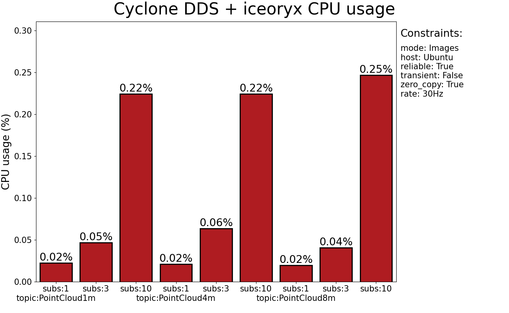
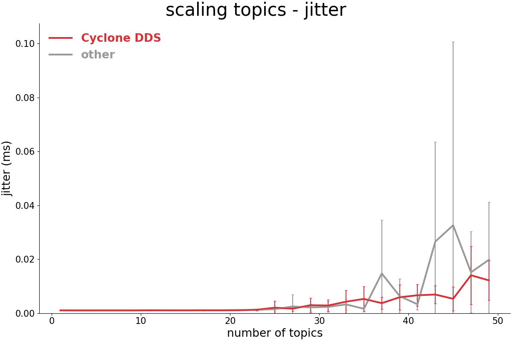
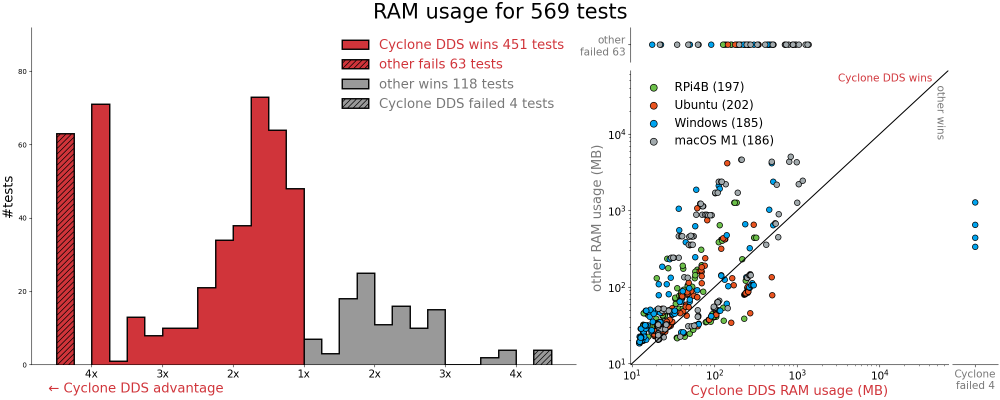
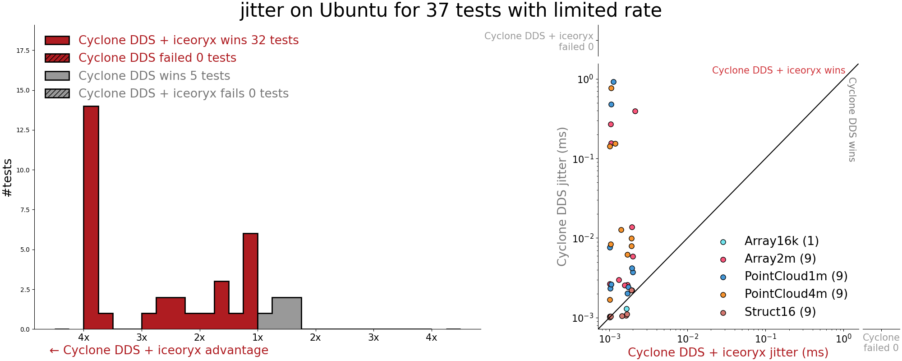

# 2021 Eclipse Cyclone DDS ROS Middleware Evaluation Report with iceoryx and Zenoh

## Index

 * [Introduction](#introduction)
 * [Performance](#performance)
 * [Services](#services)
 * [WiFi](#wifi)
 * [Features](#features)
 * [Quality](#quality)
 * [Free-form](#free-form)
 * [Appendix A: Test Environment](#appendix-a-test-environment)
 * [Appendix B: Performance Summary Per Platform](#appendix-b-performance-summary-per-platform)
 * [Appendix C: Tests that fail with OS network buffer defaults](#appendix-c-tests-that-fail-with-os-network-buffer-defaults)

## Introduction

This report is our response to the [Default DDS Provider Questionnaire](https://osrf.github.io/TSC-RMW-Reports/humble/dds_provider_question_template.html) provided by Open Robotics. This report includes [everything required](eclipse-cyclonedds-report/) to understand and reproduce the test results. Artifacts provided include [how-to instructions](eclipse-cyclonedds-report/reproducing.md) for reproducing everything in this report, including test scripts, graph plot scripts, raw data, tabulated data, detailed test result PDF for each test, and the summary plots you see below.

The Eclipse Foundation [eclipse.org](https://www.eclipse.org/) provides our global community of individuals and organizations with a mature, scalable, and business-friendly environment for open source software collaboration and innovation. The Foundation is home to the Eclipse IDE, Jakarta EE, and over 350 open source projects, including runtimes, tools, and frameworks for a wide range of technology domains such as the Internet of Things, automotive, geospatial, systems engineering, and many others. The Eclipse Foundation is a European-based international not-for-profit association supported by over 300[ members](https://www.eclipse.org/membership) who value the Foundation’s unique[ Working Group](https://www.eclipse.org/org/workinggroups/) governance model, open innovation processes, and[ community-building events](http://events.eclipse.org/). 

[Eclipse Cyclone DDS](https://cyclonedds.io) and [Eclipse iceoryx](https://iceoryx.io/v1.0.1/) are projects of the [Eclipse IoT](https://iot.eclipse.org) and [Eclipse OpenADx](https://openadx.eclipse.org) (Autonomous Driving) WGs. [Eclipse Zenoh](https://zenoh.io) is a project of Eclipse IoT and [Eclipse Edge Native WG](https://edgenative.eclipse.org).

Eclipse Cyclone DDS is a small, easy and performant implementation of the OMG DDS specification. Eclipse iceoryx is a zero-copy pub/sub implementation for high bandwidth sensors such as cameras, LiDARs and is built into Cyclone DDS 0.8 and later. Eclipse Zenoh [ROS 2 DDS plugin](https://github.com/eclipse-zenoh/zenoh-plugin-dds) adds support for distributed discovery, wireless, WAN, Internet, microcontrollers, micro-ROS and is in the next ROS 2 Rolling sync. Example Zenoh users include [5G cloud robotics EU Horizon 2020](https://discourse.ros.org/t/uc3m-madrid-5g-ros-zenoh-digital-twin-teleop-technical-review-demo/18287) at [Universidad Carlos III de Madrid](https://www.uc3m.es/ss/Satellite/UC3MInstitucional/en/Detalle/Comunicacion_C/1371282498910/1371216052687/Deployment_of_5G_technology_in_drones_and_robots), [Indy Autonomous Challenge ROS 2 racecars](https://zenoh.io/blog/2021-09-28-iac-experiences-from-the-trenches/) and [US Air Force's Ghost Robotics ROS 2 robodogs](https://www.tyndall.af.mil/News/Article-Display/Article/2550793/tyndall-brings-in-the-big-dogs/).

Users get technical support via github issues, [cyclonedds gitter](https://gitter.im/atolab/cyclone-dds), [iceoryx gitter](https://gitter.im/eclipse/iceoryx) and [zenoh gitter](https://gitter.im/atolab/zenoh). Technical support is provided by the contributors and the user community. Project documentation besides READMEs is here: [cyclonedds.io](https://cyclonedds.io/docs), [iceoryx.io](https://iceoryx.io), [zenoh.io](https://zenoh.io) and [blog](https://zenoh.io/blog/2021-09-28-iac-experiences-from-the-trenches/).

Contributors to Eclipse Cyclone DDS with iceoryx and Zenoh include ADLINK, Apex.AI, Bosch, Open Robotics, Rover Robotics and dozens of ROS community members.

These are active projects as you can see here: [cyclonedds](https://github.com/eclipse-cyclonedds/cyclonedds/pulse/monthly), [iceoryx](https://github.com/eclipse-iceoryx/iceoryx/pulse/monthly), [zenoh](https://github.com/eclipse-zenoh/zenoh/pulse/monthly), [rmw_cyclonedds](https://github.com/ros2/rmw_cyclonedds/pulse/monthly), [zenoh-plugin-dds](https://github.com/eclipse-zenoh/zenoh-plugin-dds/pulse/monthly), [zenoh-pico](https://github.com/eclipse-zenoh/zenoh-pico/pulse/monthly), [cyclonedds-cxx](https://github.com/eclipse-cyclonedds/cyclonedds-cxx/pulse/monthly). Note that [Eclipse Foundation Development Process](https://www.eclipse.org/projects/dev_process/) results in contributions being made as a smaller number of larger and thoroughly tested chunks. This means that the number of commits instead of number of pull requests is a more appropriate way to measure the liveliness of Eclipse projects. 

ADLINK’s DDS team co-invented DDS, co-founded the OMG DDS SIG and contributed much of the original DDS specification. ADLINK DDS team co-authored many of the current DDS Specifications and actively participates in spec revisions and future DDS related specs. ADLINK co-chairs the OMG DDS Technical Committee.


## Performance

A large number of tests were run with different combinations of data type, message size, message frequency, number of subscribers, and Quality of Service (QoS) settings. From struct16 to pointcloud8m data types and sizes. For frequency, tests were run from 1Hz to 500Hz, to unlimited free-running. Experiments were also run with 1 subscriber up to 10 subscribers. Each scenario is repeated with two different QoS configurations (originally there were 4 QoS configurations, but we realized there was no difference in the results). Scaling tests were run for 1 to 50 topics and nodes. The tests, raw data, tabulated data, and plots are [here](eclipse-cyclonedds-report/). The test result summary spreadsheets are [here](eclipse-cyclonedds-report/tables).


### Throughput and latency for large messages

__Without configuration, what is the throughput and latency (in addition to any other relevant metrics) when transferring large topics (like ~4K camera images) at medium frequencies (~30Hz)?__

Here are 4MB messages at 20Hz. How to instructions, test scripts, raw data, tabulated data, tabulation scripts, plotting scripts and detailed test result PDFs for every individual test are [here](eclipse-cyclonedds-report/).


Note: Regarding Cyclone DDS CPU usage reporting as “0.0%” for Windows 10, the resolution of the timing was such that the measurement is below the threshold. The CPU usage on Windows 10 was probably similar to the Ubuntu results, but we simply couldn’t measure it in this test run.

The tests were run again at 30Hz on using the rclcpp RMW LoanedMessage API with shared memory. Results are shown for Cyclone DDS + iceoryx. The instructions to use zero-copy with Cyclone DDS + iceoryx are [here](https://github.com/ros2/rmw_cyclonedds/blob/galactic/shared_memory_support.md). Software engineers at ADLINK & Apex.AI followed the other middleware's published instructions to use LoanedMessage API, but the other middleware failed these tests without getting any messages through.




__Without configuration, how does the implementation scale with the number of topics in the system?__

Cyclone DDS scales well with the number of topics without configuration. These test findings are consistent with those reported to us by iRobot and Tractonomy. Shown below are the effects of scaling the number of topics and nodes with struct16 messages at 500 Hz on Ubuntu 20.04.3 amd64. How to instructions, test scripts, raw data, tabulated data, tabulation scripts, plotting scripts and detailed test result PDFs for every individual test are [here](eclipse-cyclonedds-report/).




__Without configuration, how does the implementation scale with the number of nodes in the system?__

Cyclone DDS scales well with the number of nodes without configuration. In the charts below you see scaling the number of nodes with one topic per node with struct16 messages at 500 Hz on Ubuntu 20.04.3 amd64. How to instructions, test scripts, raw data, tabulated data, tabulation scripts, plotting scripts and detailed test result PDFs for every individual test are [here](eclipse-cyclonedds-report/).


### General performance

__Please provide benchmarks for inter-host, inter-process (with and without LoanedMessages), and intra-process (with and without LoanedMessages) throughput for both large and small message sizes, on both Linux and Windows.__

Following is the summary overview of the results for all tests, all platforms. How to instructions, test scripts, raw data, tabulated data, tabulation scripts, plotting scripts and detailed test result PDFs for every individual test are [here](eclipse-cyclonedds-report/). Also see [Appendix B: Performance Summary Per Platform](#appendix-b-performance-summary-per-platform).

For 569 tests with varying message types, sizes, rates, subscribers, QoS, and platforms the result was the following (also see the graphs below the bullet list):


* Cyclone DDS has lower latency in 443 tests
* Cyclone DDS has lower latency jitter in 447 tests
* Cyclone DDS has higher throughput in 106 of 141 tests with other failing 37 of the 141 throughput tests
* Cyclone DDS has lower memory utilization in 451 tests
* Cyclone DDS has lower CPU utilization in 484 tests (387 limited + 97 unlimited)
* Cyclone DDS scaled better by number of topics and nodes
* Cyclone DDS failed 4 tests while the other middleware failed 63 tests
* Cyclone DDS failed 4 tests were Windows 10 default network buffer size, large messages, 500Hz





### Cyclone DDS with iceoryx Improvement

Cyclone DDS with built-in iceoryx zero-copy was tested using the rclcpp RMW “LoanedMessage” API. As you can see below Cyclone DDS with iceoryx improves upon Cyclone DDS in every measure: latency, jitter, throughput, memory, total CPU usage, relative CPU per message. The instructions to use zero-copy with Cyclone DDS + iceoryx are [here](https://github.com/ros2/rmw_cyclonedds/blob/galactic/shared_memory_support.md). Software engineers at ADLINK & Apex.AI followed the other middleware's published instructions to use LoanedMessage API, but the other middleware failed these tests without getting any messages through.





### Inter-host Performance
Inter-host test detailed plots are [here](eclipse-cyclonedds-report/plots), and the most relevant plots are shown below. 

* Cyclone DDS wins 90 times while the other implementation wins 35 times
* Cyclone DDS fails 0 tests while the other implementation fails 8 tests


__For a pub/sub pair in separate processes, what is the average round-trip time, throughput, and CPU/memory utilization? How does this scale with topic frequency and topic size?__

Multi-process test results are covered elsewhere in this report, the plots are [here](eclipse-cyclonedds-report/plots), the test scripts, raw data, tabulated data are [here](eclipse-cyclonedds-report/).


## Services

__Several users have reported instances where services never appear, or they never get responses. What do you think the problems might be, and what are you doing to try and address these problems?__


* __[ros2/ros2/issues/1074](https://github.com/ros2/ros2/issues/1074)__
* __[ros2/rmw_fastrtps/issues/392](https://github.com/ros2/rmw_fastrtps/issues/392)__
* __[ros2/rmw_fastrtps/pull/418](https://github.com/ros2/rmw_fastrtps/pull/418)__
* __[ros2/rmw_cyclonedds/issues/74](https://github.com/ros2/rmw_cyclonedds/issues/74)__
* __[ros2/rmw_cyclonedds/issues/191](https://github.com/ros2/rmw_cyclonedds/issues/191)__

The only referenced issues are timing-related and tickets left open for the day things change and some code to work around missing guarantees in the DDS discovery protocol can be removed. Starting with the latter, since the introduction of that in the RMW layer in June 2020, we have not received any reports of missing service responses, and we believe this to be reliable. The main downside is that it can delay the service on servicing the first request from a given client by the discovery latency if that client initiates the request immediately upon discovering the service.

Given that it may delay the service response for the first request, this therefore does provide a plausible explanation to the “delayed first response” symptom in [ros2/ros2/issues/1074](https://github.com/ros2/ros2/issues/1074).

Secondly, with a service request timeout of 10ms, if either the request or response message is lost, the repair will likely have to wait until a timer goes off, because requests and responses are typically not immediately followed by further messages on the same writer. The typical timing for recovery in such circumstances is in the order of 10s of milliseconds.

So the observed behaviour is in line with expectations. We do intend to provide more guarantees in the DDS discovery protocol that will allow the client to wait until the request can be handled without further discovery-related delays. This serves the Cyclone DDS user base more generally than only improving service requests.

The longish recovery delay when the final message before the writer falls silent for a while is something that we would like to improve on. It necessarily involves waiting on a timer and sending additional packets, and is thus not likely to ever recover in less than a few milliseconds. On WiFi the delays will necessarily be longer because WiFi has a relatively high intrinsic latency.

__How do services scale with the number of clients? And/or the amount of request traffic?__

Client/service interaction is implemented using a pair of topics, following the existing design for services at the time of implementing the Cyclone DDS RMW layer. That means each client and each server introduces two endpoints. The standard discovery protocol requires these to be advertised to all other processes in the network. At the level of DDS discovery, each additional client causes an amount of work/traffic that scales linearly with the size of the system.

For ensuring delivery of responses (in the absence of loss of connectivity), the services check locally cached data, which is also linear in the number of clients.

The actual response message is (currently) sent to all readers of that particular topic. If multicast is available, this means a single message, but even so, there will be acknowledgements sent back from each reader. So again, linear in the number of clients.

The intent has always been to start using writer-side content filtering once that is available, but this has been delayed for a variety of reasons. We are considering extending the API to directly support writing to a specific reader (which can be considered as a special case of writer-side content-filtering). This will prevent responses being sent to all clients.


## WiFi

__We’ve had a lot of reports from users of problems using ROS 2 over WiFi. What do you think the causes of the problems are, and what are you doing to try to address these problems?__


* __Some example issues from users:__
    * __[Bad performance of ROS 2 via WiFi](https://answers.ros.org/question/362065/bad-performance-of-ros2-via-wifi/)__
    * __[ROS 2 default behavior on WIFi](https://discourse.ros.org/t/ros2-default-behavior-wifi/13460/38)__
    * __[Bad networks dragging down localhost communication](https://discourse.ros.org/t/bad-networks-dragging-down-localhost-communication/20611)__

The challenges of DDS when operating over WiFi are relatively well known to those that have been  involved with DDS for sufficiently long time. The main causes of these challenges are related (1) the fact that DDS heavily relies on UDP/IP multicast communication which is know to be problematic on WiFi, (2) the verbosity of DDS discovery protocol, and (3) the lossy nature of WiFi. 

In order to alleviate these and other challenges posed by DDS when trying to scale out or run over Wide Area Network we have the designed the zenoh protocol and implemented it as part of the Eclipse Zenoh project (see http://zenoh.io). 

Below we describe how zenoh can be transparently used by ROS2 applications to improve their behaviour over WiFi and in general to have better scalability as well as transparently operate at Internet scale.


__How well does the implementation work out-of-the-box over WiFi?__

Cyclone DDS over WiFi "just works" unless the WiFi is reached via a wired network. Because whether or not the selected interface is a wifi interface determines whether Cyclone DDS uses `allowmulticast=true` or `allowmulticast=spdp` (multicast discover, unicast data).

So if it is using an Ethernet that integrates in a WiFi network, it sees a wired network and sets it to true, where you might have wanted to manually set it to spdp which sets it to multicast discovery & unicast data.

When we run Cyclone DDS over WiFi, we have no problems, it “just works”. Your mileage may vary with application topology, number of nodes, topics, data rates & sizes, type of WiFi, antenna type & WiFi chipset,  background noise, and movement of network nodes.

In the default configuration it works by sending packets using UDP/IP. If the network works well, it works well. If the network doesn't work well, it works less well. If the network is very bad, it won't work.

It is worth noting that the DDSI stack in Cyclone DDS has been deployed for a decade providing the communication via WiFi between autonomous vehicles from a top agriculture machinery manufacturer.

ROS 2 applications that want to leverage zenoh for R2X communication can simply deploy an instance of the [zenoh-plugin-dds](https://github.com/eclipse-zenoh/zenoh-plugin-dds) and transparently communicate over WiFi.

Zenoh’s default configuration has been proven to reduce DDS discovery traffic by 97% (see[ https://zenoh.io/blog/2021-03-23-discovery/](https://zenoh.io/blog/2021-03-23-discovery/)) and with some tuning, we have seen it dropping the discovery traffic by over 99%.


__How does the system behave when a robot leaves WiFi range and then reconnects?__

With Cyclone DDS this behaves the same as well as others. With [zenoh-plugin-dds](https://github.com/eclipse-zenoh/zenoh-plugin-dds) the disruption of a temporary out-of-range WiFi link is quickly resolved once the connection is re-established. As the level of discovery information shared by the zenoh protocol is extremely small when compared to DDS, and much of the information exchanged by DDS is not even necessary, the communication is re-established immediately without inundating the network with discovery data as in the DDS case.

The disruption of a temporary out of range WiFi link is quickly resolved once the connection is re-established. As the level of discovery information shared by the zenoh protocol in extremely small when compared to DDS, and much of the information exchanged by DDS is not even necessary, the communication is re-established immediately without inundating the network with discovery data as in the DDS case.


__How long does it take to launch a large application like RViz2 over WiFi?__

Cyclone DDS and other RMW both launch large applications like RViz2 over WiFi in the same amount of time. Rover Robotics has done much testing of [Nav2 bring up with RViz2 over WiFi](https://youtu.be/k7ogOKzgRFw).

This question really depends on the network and the complexity of the robot. However, as zenoh reduced DDS discovery by up to 99.97% the start-up time is dramatically reduced. There is discussion of that here: [Minimizing ROS 2 discovery traffic](https://discourse.ros.org/t/minimising-ros2-discovery-traffic/19614) 


__What is a solution for default DDS discovery on lossy networks?__

Leveraging the [zenoh-plugin-dds](https://github.com/eclipse-zenoh/zenoh-plugin-dds) addresses the problem of lossy networks where it does not leverage multicast, and the protocol is extremely parsimonious and wire efficient. [Here is overview and tutorial](https://zenoh.io/blog/2021-04-28-ros2-integration/) using ROS 2 turtlebot. This plugin is in the next Rolling sync.


__How does performance scale with the number of robots present in a WiFi network?__

In DDS, the discovery data is sent from everyone to everyone else in spite of actual interest. Additionally, DDS shares discovery data for readers / writers and topics. As tested by iRobot, Cyclone DDS scales well. Additionally, Erik Boasson added _domainTag_ to the OMG DDSI 2.3 specification to support implementing iRobot’s use case - [find any Roomba by serial number](https://static1.squarespace.com/static/51df34b1e4b08840dcfd2841/t/5e60b8674ae5d240e8dc4219/1583396998832/ROS-I+2019+Eclipse+Cyclone+DDS+-+Joe+Speed+-+low+rez.pdf) among ~1,000 robots on the network.

In zenoh, only subscriptions are shared and more importantly the resource generalisation mechanism described in [eclipse-zenoh/zenoh-plugin-dds](https://github.com/eclipse-zenoh/zenoh-plugin-dds) allows to reduce the entire set of subscriptions of a robot to a single expression. 

Thus the improved scalability provided by the zenoh-plugin-dds over DDS is a consequence of the very nature of the protocol.


## Features

__What is the roadmap and where is it documented?__

The Cyclone DDS + iceoryx joint roadmap is here: [Apex.Middleware](https://www.apex.ai/apex-middleware). Here are the stand-alone roadmaps for [Eclipse Cyclone DDS](https://github.com/eclipse-cyclonedds/cyclonedds/blob/master/ROADMAP.md), [Eclipse iceoryx](https://projects.eclipse.org/projects/technology.iceoryx), and [Eclipse Zenoh](https://github.com/eclipse-zenoh/zenoh/wiki/2021).

__Can the middleware be configured to be memory-static at runtime?__

No, however the design and architecture of the middleware components do not prevent them from being hardened to be memory-static at runtime. Currently performance is paramount over being memory-static at runtime. In addition, through proper configuration of Cyclone DDS and iceoryx, runtime allocations can be avoided in many places (through the use of upper-bounded messages, and using zero copy where appropriate).

__What support is there for microcontrollers?__

Zenoh-pico (see [eclipse-zenoh/zenoh-pico](https://github.com/eclipse-zenoh/zenoh-pico)) supports micro-controllers such as STM32, ESP32, and the Zephyr OS reference board, namely the reel board. Zenoh-pico supports micro-ROS with [rmw_zenoh_pico_cpp](https://github.com/atolab/rmw_zenoh/tree/main/rmw_zenoh_pico_cpp). Zenoh-pico uses the Zenoh ROS 2 DDS plugin [zenoh-plugin-dds](https://github.com/eclipse-zenoh/zenoh-plugin-dds/blob/master/README.md) which works with all Tier 1 ROS Middleware and is in next ROS 2 Rolling sync. Zenoh-pico overview and step-by-step "how to" instructions are [here](https://zenoh.io/blog/2021-10-04-zenoh-pico-guide/). Instructions for ROS 2 with Zenoh are [here](https://zenoh.io/blog/2021-04-28-ros2-integration/). Instructions for using Cyclone DDS with Zenoh on constrained networks are [here](https://zenoh.io/blog/2021-09-28-iac-experiences-from-the-trenches/). 

__Are there tools available for integrating/bridging with other protocols (MQTT, etc)? What are they, and how do they work?__

Yes. The provided simple APIs and multiple language bindings facilitate integration/bridging with other protocols via Eclipse Cyclone DDS [sister projects](iot.eclipse.org/projects) Eclipse Paho (MQTT), Eclipse Milo (OPC-UA), Eclipse Tahu (legacy SCADA/DCS/ICS), Eclipse Californium (COAP), et al. Cyclone DDS’s 37 sister projects are listed here [iot.eclipse.org/projects](https://iot.eclipse.org/projects/) 

__How much adherence is there to the RTPS standard?__

Full adherence with one exception; for interoperability with the other middleware, Cyclone DDS has been modified accept some invalid messages that the other ROS middleware sends despite the RTPS specification demanding that those be ignored.

__How much support for the DDS-Security specification is provided in the DDS implementation?__

DDS-Security specification support is described [here](https://cyclonedds.io/docs/cyclonedds/latest/security.html). The three plugins that comprise the DDS Security Model in Cyclone DDS are: Authentication Service Plugin; Access Control Service Plugin; Cryptographic Service Plugin. Cyclone DDS implements (or interfaces with libraries that implement) all cryptographic operations including encryption, decryption, hashing, digital signatures, etc. This includes the means to derive keys from a shared secret.

__Does the package have explicit tooling and support for protocol dissection?__

Yes. [Wireshark](https://www.wireshark.org), [performance_test](https://gitlab.com/ApexAI/performance_test/), and [ddsperf](https://github.com/eclipse-cyclonedds/cyclonedds#performance). Please refer to the [cyclonedds.io/docs](https://cyclonedds.io/docs), [performance_test](https://gitlab.com/ApexAI/performance_test/-/blob/master/README.md), and the  [“Debugging”](https://github.com/ros2/rmw_cyclonedds/blob/master/README.md) section of rmw_cyclonedds readme. The Wireshark DDSI-RTPS plugin is [here](https://www.wireshark.org/docs/dfref/r/rtps2.html).


* Create a Wireshark capture: wireshark -k -w wireshark.pcap.gz
* Performance_test for generating workloads and traffic using performance_test or ddsperf.
* Configure Cyclone to create richer debugging/tracing output


## Quality

__What is the currently self-declared REP-2004 quality of the package implementing the RTPS/DDS protocols and the RMW?__

Cyclone DDS and iceoryx are self-declared to be Quality Level 2 [here](https://github.com/eclipse-cyclonedds/cyclonedds/compare/master...eboasson:ql2declaration?expand=1) and [here](https://github.com/eclipse-iceoryx/iceoryx/blob/master/QUALITY_DECLARATION.md).

__How else does the package measure quality? Please list specific procedures or tools that are used.__

[Eclipse Foundation Development Process](https://www.eclipse.org/projects/dev_process/) has been refined over the course of hundreds of projects to produce high quality software. The development process also addresses project lifecycle, reviews, releases and grievances. Automated quality testing includes CI, test coverage, static code analysis, integration tests, and sanitizer tests as described in the report section “_What kinds of tests are run?_” further below. Project documentation besides the READMEs is found here: [cyclonedds.io/docs](https://cyclonedds.io/docs), [iceoryx.io](https://iceoryx.io), [zenoh.io](https://zenoh.io) and [blog](https://zenoh.io/blog/2021-09-28-iac-experiences-from-the-trenches/).

__Where is the development process documented?__

These projects follow the [Eclipse Foundation Development Process](https://www.eclipse.org/projects/dev_process/). It documents the development process used by hundreds of Eclipse Foundation projects including Cyclone DDS, iceoryx and Zenoh. In addition, the contributing guidelines are documented here for [Cyclone DDS](https://github.com/eclipse-cyclonedds/cyclonedds/blob/master/CONTRIBUTING.md), [iceoryx](https://github.com/eclipse-iceoryx/iceoryx/blob/master/CONTRIBUTING.md) and [Zenoh](https://github.com/eclipse-zenoh/zenoh/blob/master/CONTRIBUTING.md). Note that [Eclipse Foundation Development Process](https://www.eclipse.org/projects/dev_process/) results in contributions being a smaller number of larger and thoroughly tested chunks. This means that looking at the number of commits instead of number of pull requests is a more appropriate way to evaluate the liveliness of any Eclipse project including these. 

__What kinds of tests are run? Smoke tests, unit tests, integration tests, load tests, coverage? What platforms are each of the tests run on?__

The following kinds of tests are run:


* Continuous Integration [cyclonedds CI](https://dev.azure.com/eclipse-cyclonedds/cyclonedds ), [iceoryx CI ](https://github.com/eclipse-iceoryx/iceoryx/actions )
* Test coverage [cyclonedds test coverage](https://dev.azure.com/eclipse-cyclonedds/cyclonedds/_build/results?buildId=1117&view=codecoverage-tab), [iceoryx test coverage](https://app.codecov.io/gh/eclipse-iceoryx/iceoryx)
* Static code analysis [cyclonedds static code analysis](https://scan.coverity.com/projects/eclipse-cyclonedds-cyclonedds), iceoryx static code analysis uses commercial tools [PC-Lint Plus](https://www.gimpel.com) and [Axivion Suite](https://www.axivion.com/en/products/axivion-suite/). Additionally we are working on the introduction of [clang_tidy](https://clang.llvm.org/extra/clang-tidy/) which will be enabled with the iceoryx 2.0 release planned for Humble and will be run publicly on github.
* Sanitizer tests of the [cyclonedds CI](https://dev.azure.com/eclipse-cyclonedds/cyclonedds). Here are the [iceoryx sanitizer tests](https://github.com/eclipse-iceoryx/iceoryx/actions?query=workflow%3ASanitize).

Additionally, Open Robotics runs the [full ROS 2 test suite](https://build.ros2.org) with Cyclone DDS nightly.

__Has the DDS Security implementation been audited by a third-party?__

Yes. [Trend Micro security researchers](https://www.trendmicro.com/en_us/about/threat-research.html) working on security vulnerability research audit Eclipse Cyclone DDS with Eclipse iceoryx. These security researchers perform [fuzz testing](https://en.wikipedia.org/wiki/Fuzzing) of Cyclone DDS with icoeryx to test for security vulnerabilities. They are automating the vulnerability searches.


## Free-form

_In this section, you can add any additional information that you think is relevant to your RMW implementation. For instance, if your implementation has unique features, you can explain them here. These should be things technical in nature, not just marketing. Please keep your responses limited to 2000 words with a reasonable number of graphs; we’ll truncate anything longer than that during editing of the report. If you cannot fit all of your data into the limit, feel free to provide a link to an external resource which we’ll include in the report._

 

Many have adopted the Eclipse Cyclone DDS ROS middleware after performing their technical due diligence of the available ROS middleware implementations. Adopters include:


* Default ROS middleware for [ROS 2 Galactic](https://discourse.ros.org/t/ros-2-galactic-default-middleware-announced/18064) 
* Most [Nav2](https://github.com/ros-planning/navigation2) users run Eclipse Cyclone DDS per the Nav2 WG Leader
* Default ROS middleware for [Autoware Foundation](https://www.autoware.org/autoware-auto) developers
* Default ROS middleware for [Apex.OS](https://www.apex.ai/apex-os) 
* Default ROS middleware for [Indy Autonomous Challenge](https://www.indyautonomouschallenge.com) Base Vehicle Software WG
* Default ROS middleware for [SVL Simulator ](https://www.svlsimulator.com)
* Default ROS middleware for [SOAFEE](http://soafee.io) "Sophie" Scalable Open Architecture For Embedded Edge open source with Arm, ADLINK, Apex.AI, AutoCore, Capgemini Engineering, Continental, CARIAD, Green Hills Software, Linaro, Marvell, MIH Consortium, Red Hat, SUSE, Tier IV, Volkswagen, Woven Planet (Toyota Research), Zing Robotics as explained [here](https://www.arm.com/company/news/2021/09/new-arm-technologies-to-transform-the-software-defined-future-for-the-automotive-industry). ZDNet explains SOAFEE [here](https://www.zdnet.com/article/arm-lays-the-groundwork-for-the-software-defined-vehicle/).
* [Eclipse Cyclone DDS adopters](https://iot.eclipse.org/adopters/#iot.cyclonedds), [Eclipse iceoryx adopters](https://iot.eclipse.org/adopters/#technology.iceoryx), [Eclipse Zenoh adopters](https://iot.eclipse.org/adopters/#iot.zenoh)

We also strongly support and encourage the ROS 2 community and ROS 2 projects such as Navigation2, MoveIt2 and Autoware.Auto.

The DDSI core of Cyclone DDS is widely deployed in thousands of mission critical systems including Fujitsu fiber switches in the Internet backbone and [AT&T network](https://www.fujitsu.com/us/about/resources/news/press-releases/2019/fnc-20190606.html); autonomous agricultural vehicles; NASA programs, 560 megawatt gas turbines, ship defence systems of 18 countries, and cow milking robots which is udderly delightful.🐄

Cyclone DDS has progressed from REP 2004 Quality Level 4 in 2019 to Quality Level 3 in 2020 and Quality Level 2 in 2021. We expect Cyclone DDS and iceoryx to be Quality Level 1 in 2022 (except for section [4.v.a](https://ros.org/reps/rep-2004.html#quality-level-1) automated code style enforcement which the Cyclone DDS lead committer Erik Boasson has determined is the work of the devil).

Something that is beyond the scope of this report but worth mentioning is that there is higher performance available especially for larger messages to the Cyclone DDS user if they want to change defaults such as:


* Increase maximum message size
* Increase fragment size
* Increase high-water mark for the reliability window on the writer side
* Increases to the default kernel network buffer sizes such as the UDP receive buffers (`net.core.rmem_max`, `net.core.rmem_default`)

For Cyclone DDS + iceoryx users of LoanedMessage API with shared memory, the behavior is already well optimized and there is little need to change anythings from defaults.


## Appendix A: Test Environment 

“Ubuntu” AMD Ryzen 5 5600X (turbo disabled), 32GB DDR4-3600 RAM, Ubuntu 20.04.3 HWE  

* [ROS 2 Galactic Patch Release 1](https://github.com/ros2/ros2/releases/tag/release-galactic-20210716) amd64 binary download
* [Apex.AI/performance_test](https://gitlab.com/ApexAI/performance_test/)

“Windows 10” AMD Ryzen 5 5600X (turbo disabled), 32GB DDR4-3600 RAM, Windows 10 Pro Version 21H1 Build 19043.1237

* Visual Studio 2019
* [ROS 2 Galactic Patch Release 1](https://github.com/ros2/ros2/releases/tag/release-galactic-20210716) built from source 
* [Apex.AI/performance_test](https://gitlab.com/ApexAI/performance_test/)

““RPi4B” Raspberry Pi Model 4B, 4GB RAM, Ubuntu 20.04.3

* [ROS 2 Galactic Patch Release 1](https://github.com/ros2/ros2/releases/tag/release-galactic-20210716) arm64 binary download
* [Apex.AI/performance_test](https://gitlab.com/ApexAI/performance_test/)

“macOS M1” Macbook Pro M1 2020, macOS Big Sur

* [ROS 2 Galactic Patch Release 1](https://github.com/ros2/ros2/releases/tag/release-galactic-20210716) built from source 
* [Apex.AI/performance_test](https://gitlab.com/ApexAI/performance_test/)

Inter-host is pair of PCs with Intel Xeon E3-1275 v5, 32GB RAM, Ubuntu 20.04.3 HWE

* [ROS 2 Galactic Patch Release 1](https://github.com/ros2/ros2/releases/tag/release-galactic-20210716) amd64 binary download
* [Apex.AI/performance_test](https://gitlab.com/ApexAI/performance_test/)
* Netgear GS108 unmanaged switch


## Appendix B: Performance Summary Per Platform

This section shows the performance summary for each of the tested platforms. How to instructions, test scripts, raw data, tabulated data, tabulation scripts, plotting scripts and detailed plots for every individual test are [here](eclipse-cyclonedds-report/).


### Ubuntu
* Cyclone DDS wins 414 times while other wins 198 times.
* Cyclone DDS fails 0 tests while other fails 9 tests.


### Windows 10
* Cyclone DDS wins 486 times while other wins 99 times.
* Cyclone DDS fails 4 tests while other fails 30 tests.


### Raspberry Pi Model 4B
* Cyclone DDS wins 425 times while other wins 183 times.
* Cyclone DDS fails 0 tests while other fails 13 tests.


### macOS M1
* Cyclone DDS wins 506 times while other wins 106 times.
* Cyclone DDS fails 0 tests while other fails 25 tests.


## Appendix C: Tests that fail with OS network buffer defaults

The following tests fail for both middleware when run with operating system defaults on the [test hardware listed here](#appendix-a-test-environment). When Ubuntu and Windows 10 network buffer size is increased then Cyclone DDS passes these tests. But this report is about default ROS middleware “out of the box” experience. So configuration changes are outside the scope of this report. Canonical and Microsoft can consider adjusting operating system network buffer defaults so that ROS 2 “just works”. Note that "rate: 0" means the test is free-running unlimited frequency not freerunning parkour.🏃

```
host: RPi4B, mode: MultiProcess, topic: PointCloud4m, rate: 20, subs: 10, zero_copy: false, reliable true
host: Ubuntu, mode: MultiProcess, topic: PointCloud8m, rate: 0, subs: 1, zero_copy: false, reliable true
host: Ubuntu, mode: MultiProcess, topic: PointCloud8m, rate: 0, subs: 3, zero_copy: false, reliable true
host: Ubuntu, mode: MultiProcess, topic: PointCloud8m, rate: 0, subs: 10, zero_copy: false, reliable true
host: Ubuntu, mode: MultiProcess, topic: PointCloud8m, rate: 20, subs: 1, zero_copy: false, reliable true
host: Ubuntu, mode: MultiProcess, topic: PointCloud8m, rate: 20, subs: 3, zero_copy: false, reliable true
host: Ubuntu, mode: MultiProcess, topic: PointCloud8m, rate: 20, subs: 10, zero_copy: false, reliable true
host: Ubuntu, mode: MultiProcess, topic: PointCloud8m, rate: 100, subs: 1, zero_copy: false, reliable true
host: Ubuntu, mode: MultiProcess, topic: PointCloud8m, rate: 100, subs: 3, zero_copy: false, reliable true
host: Ubuntu, mode: MultiProcess, topic: PointCloud8m, rate: 100, subs: 10, zero_copy: false, reliable true
host: Ubuntu, mode: MultiProcess, topic: PointCloud8m, rate: 500, subs: 1, zero_copy: false, reliable true
host: Ubuntu, mode: MultiProcess, topic: PointCloud8m, rate: 500, subs: 3, zero_copy: false, reliable true
host: Ubuntu, mode: MultiProcess, topic: PointCloud8m, rate: 500, subs: 10, zero_copy: false, reliable true
host: Windows, mode: MultiProcess, topic: Array2m, rate: 500, subs: 10, zero_copy: false, reliable true
host: Windows, mode: MultiProcess, topic: PointCloud1m, rate: 0, subs: 1, zero_copy: false, reliable true
host: Windows, mode: MultiProcess, topic: PointCloud1m, rate: 0, subs: 3, zero_copy: false, reliable true
host: Windows, mode: MultiProcess, topic: PointCloud1m, rate: 0, subs: 10, zero_copy: false, reliable true
host: Windows, mode: MultiProcess, topic: PointCloud1m, rate: 500, subs: 10, zero_copy: false, reliable true
host: Windows, mode: MultiProcess, topic: PointCloud4m, rate: 500, subs: 10, zero_copy: false, reliable true
```
